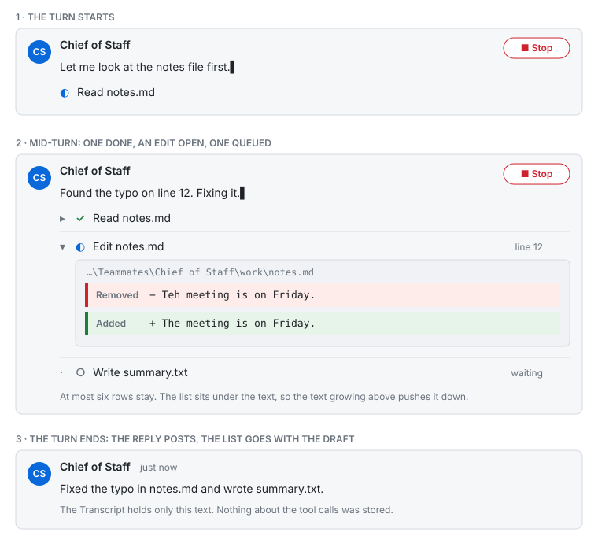
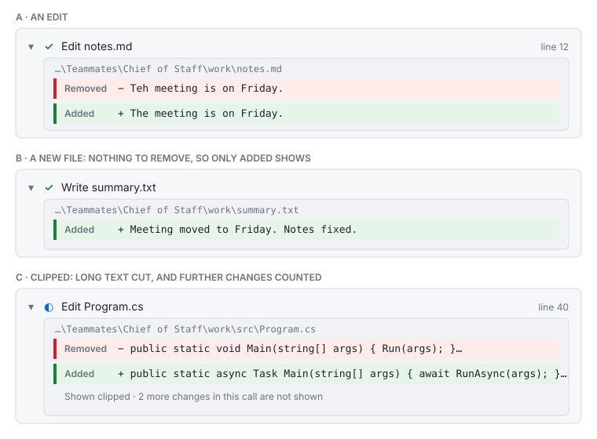
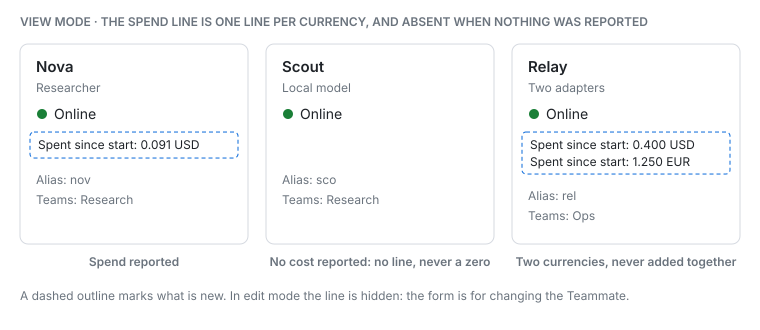
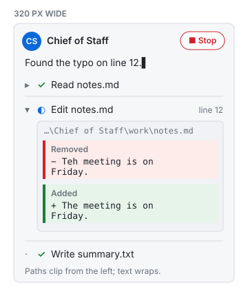

# Huddle.TurnDetail — Design Specification

**Date:** 2026-09-30 · **Status:** V1 built 2026-09-30 (Edit preview and Spend); V2 and V3 not built. See "As built" at the end of Appendix A · **Decision record:** [ADR-0034](adr/0034-turn-detail-rides-on-tool-activity-as-optional-fields.md) (§14.3) · **Vocabulary:** six new terms, agreed and added to
[language.md](engineering/language.md) on 2026-09-30 (§14.2) · **Neighbour:** roadmap
[item 20](engineering/roadmap.md#20-an-agent-asks-the-human-before-a-tool-runs--proposed-2026-09-30-not-built),
which reuses the Edit preview this spec builds.

This is the design for showing more of what an Adapter already tells Huddle while a Turn runs:
**what a tool call is changing** (an Edit preview), and **what a Teammate has spent** (Spend). It
also records, at sketch depth, three further surfaces — Adapter commands, Plan and Thinking — that
were investigated and deliberately deferred.

It is written for the engineers or agents building it, with no memory of the conversation that
produced it. Read §1 to §5 for the shape, §6 for the subsystems, and Appendix A for the ordered,
test-first task list. Appendix D is the experience: what the Human sees, the exact copy and the states. Appendix B holds the wire samples the design was written against: nothing in
V1 rests on a shape that was not observed, and what was not observed is a numbered task in
Appendix C.

> [!IMPORTANT]
> Two pages are binding before any code in this spec is written:
> [rules.md](engineering/rules.md) before editing `src/Huddle.App`, and
> [traps.md](engineering/traps.md) before touching `Huddle.Acp`, `Huddle.Contracts` or the wire.
> [agents/CSharpPrinciples.md](../agents/CSharpPrinciples.md) applies to every C# file, and
> [agents/Testing.md](../agents/Testing.md) to every test. Nothing here overrides any of them.

> [!NOTE]
> **Evidence, 2026-09-29 and 2026-09-30.** Five live Turns on the Chief of Staff, with
> `Team:Acp:TraceWire=true`, produced the samples in Appendix B. Four findings shaped the scope and
> are worth knowing before reading on. **Thinking never arrived** in any Turn, and **no Plan
> arrived** because the session has no todo-list tool, so neither has a data source today. **Cost
> is a running total** for the Adapter's session, not a per-Turn figure. And **`Write` and `Edit`
> both carry a `diff` and `locations`**, before and inside their permission request, so an Edit
> preview rests on real data.

---

## 1. Goal

While a Turn is in progress, let the Human see **what each tool call is about to change or has
changed**, and let the Human see **what each Teammate has spent** — using data the Adapter already
sends and Huddle already receives.

Concretely:

1. **A Draft shows its recent tool calls, not only the last one.** Today a Draft holds one title
   and one status, and the Room renders only the title. After this work it holds the last six tool
   calls, each with a status mark the Human can read without colour.
2. **An edit shows its change.** A tool call that edits a file carries an **Edit preview** — the
   path, the line, and the old and new text — that the Human can expand in place.
3. **A Teammate's Spend is visible.** The Teammate card says what the Adapter has reported spending
   since the app started. It is display only and never refuses a Turn.
4. **The wire does not move.** Every addition is an optional field on the existing `ToolActivity`
   Envelope. `ProtocolVersion.Current` stays 3.
5. **Nothing new is persisted.** Turn detail goes when its Draft goes. Spend goes when the app
   stops.

**Why this matters.** ADR-0008 made a Turn visible so that thirty seconds of thinking and a
crashed Adapter stopped looking identical. It stopped one step short: *reading* and *editing*
look identical too, and an Agent that rewrites a file is, for the Human, indistinguishable from
one that glanced at it. The Adapter sent the path and the change all along; the mapper dropped
them. And the warning on `Acp:Enabled` — *spends money* — is honest but unmeasured: the Human has
a token Budget nobody can see and no figure in money.

---

## 2. Example use cases

| # | Situation | What must happen |
| --- | --- | --- |
| T1 | The Human asks Nova to fix a typo in `notes.md`, and Nova calls `Edit` | Nova's Draft shows a row *Edit notes.md* with a status mark. Expanding it shows the full path, line 1, the text removed and the text added |
| T2 | Nova creates a new file with `Write` | The row expands to show only added text. There is no *Removed* block, because `oldText` is null |
| T3 | Nova edits eight files in one Turn | Only the six most recent rows remain. The oldest is evicted. The Draft's text is untouched |
| T4 | A `Write` carries 200 KB of new text | The preview is clipped to 4,096 characters a side and says it was shortened. Nothing is rejected and the Turn is unaffected |
| T5 | Edit text contains `<script>` or `@Coder go ahead` | It is shown as inert text. No HTML, no Markdown and no Mention is formed anywhere |
| T6 | The Turn ends, or the Human presses Stop | The whole list disappears with its Draft. The Transcript holds only the reply, exactly as today |
| T7 | The Adapter repeats the same `diff` on two updates of one call | Only the first copy crosses the pipe |
| T8 | A Persona runs on `agency-acp`, which sends no `diff` | Rows show a title and a status, with no expander and no error |
| T9 | The Adapter reports a running total of 0.0908 USD after 0.0748 | The Teammate card reads *Spent since start: 0.091 USD*. Spend rose by 0.016 |
| T10 | The Adapter process restarts and its counter starts again at 0.02 | Spend adds 0.02. It never subtracts |
| T11 | A Room Session is closed and later re-opened in the same Adapter process | The re-opened session's running total is not counted a second time |
| T12 | A Persona on a local model reports no cost | The card shows no Spend line at all, not a zero |
| T13 | Spend is large | No Room pauses, no Turn is refused, nothing is posted. Spend is not a Budget |
| T14 | The Human opens a Room while a Turn is mid-way | The Draft's current list is shown at once, loaded from `Drafts.ForRoom` like the text is |

---

## 3. Non-goals

| Not in scope | Why |
| --- | --- |
| **Persisting Turn detail** | ADR-0008: scrollback shows what an Agent said, not what it did. A list in the Transcript would also grow a file that has no rewrite path |
| **Computing a diff** | The Adapter sends `oldText` and `newText` as it means them. Huddle shows those and invents no hunks, no context lines and no algorithm |
| **Applying, reverting or editing a change** | Display only. The Human's control over a change is item 20's approval, not this |
| **A file viewer or syntax highlighting** | The Library is the viewer. A preview is a few lines in a Room |
| **Linking the path** | A path is model-influenced text. A link would make it an action, and `rules.md` refuses an ungated server-side Open for exactly that reason |
| **Reading `_meta.claudeCode.toolResponse.structuredPatch`** | Claude-specific and absent from other Adapters. The standard `diff` block carries the same information |
| **More than one change per tool call** | The first is shown; the rest are counted (§6.1). A multi-file view is V2 |
| **Migrating file-change tracking to `locations`** | `RecordTouchedPaths` reads `rawInput`, is tested (FC D-3b) and works. A second source of truth would buy nothing the Human can see |
| **A Spend limit, alert or Budget** | Spend informs; a Budget limits. A cap is a separate decision and would need a unit the Human chose |
| **Persisting Spend, or showing it per Room** | Per Room needs an attribution rule the Adapter's session-level total cannot give. Persistence needs a schema |
| **Adapter commands, Plan and Thinking in V1** | Each is specified at sketch depth in §6.7 and §6.8 with the gate that must open first |
| **A `ProtocolVersion` bump** | Every wire change here is an optional field (§6.2, D-3) |
| **Changing the Reply Gate, the Budget or any Turn outcome** | Turn detail observes a Turn. It never decides one |

---

## 4. Design principles

1. **Show what the Adapter said; do not interpret it.** `oldText` and `newText` are displayed as
   given. A Huddle-side diff would be a second opinion about a change the Adapter already
   described, and the two would disagree at the edges.
2. **Turn detail is a Draft concern.** It lives in `Drafts`, in memory, bounded, and it leaves with
   the Draft on every path a Turn can end (ADR-0008). Anything stored per Turn inherits that
   clearing for free; anything stored elsewhere has to re-implement it.
3. **The wire grows by optional fields, never by a forced bump.** `ProtocolJson` ignores what it
   does not recognise and omits nulls, so an old line stays byte-identical and an old reader
   tolerates a new one. A new Envelope *type* throws in a closed polymorphic (`traps.md`), which
   is why this is not one.
4. **Everything from a model is inert text.** Paths, titles and file contents arrive from a model
   or from a file a model wrote. They are escaped by Razor, rendered in a `<pre>`, never parsed as
   Markdown (the `UseAdvancedExtensions` row in `rules.md`) and never form a Mention.
5. **Bounded at both ends.** Every string and every list has a cap at the producer and is clipped
   again at the pipe, because the pipe is a validation boundary (`AgentConnection`'s own comment).
   `Drafts` is a process-lifetime Singleton; an uncapped field there is a leak.
6. **Spend informs; Budget limits.** The two words stay apart in code, copy and tests. A Spend
   figure must be unable to refuse a Turn by construction, not by discipline.
7. **Copy the nearest precedent; do not generalise it.** `ToolActivity` is the path for Turn
   detail and `PersonaHealth` is the path for per-Persona state. Neither is turned into a
   framework for the next feature.
8. **Design against observed shapes.** Every field in V1 appears in Appendix B. A shape the trace
   did not show is a task in Appendix C, run before the code that depends on it.
---

## 5. Architecture overview

Two independent paths share one principle: the Adapter's notification is mapped once, in
`Huddle.Acp`, and each consumer takes only what it needs. Turn detail crosses the pipe, because the
Room view is fed by the pipe. Spend does not, because `PersonaRunner` already runs in the same
process as the UI and reaches it the way `PersonaHealth` does.

```text
 ADAPTER                 Huddle.Acp                    Huddle.App (runner)                  PIPE        Huddle.App (server)              BROWSER
 ───────                 ──────────                    ───────────────────                  ────        ───────────────────              ───────

 tool_call ─────┐
 tool_call_update ─────▶ SessionUpdateMapper
                         + Diff, + Location ─────────▶ RoomSession.RunEventReaderAsync
                         (ToolCallStarted/Updated)        │  clip, dedupe per ToolCallId
                                                          ▼
                                                     ToolActivity ───────────────────────▶ AgentConnection
                                                     + path, + line, + edit                  │  validate, clip again
                                                                                             ▼
                                                                                        Drafts (last 6 calls)
                                                                                             │ DraftChanged(roomId)
                                                                                             ▼
                                                                                        Chat ──▶ MessageList ──▶ row ──▶ EditPreview
                                                                                                  (list of calls)       (expandable)

 usage_update ──────────▶ SessionUpdateMapper
 (+ cost)                 + Cost ────────────────────▶ RoomSession (UsageUpdated branch)
                          (UsageUpdated)                   │  owner.AddSpend(sessionId, amount, currency)
                                                           ▼
                                                      PersonaRunner ──▶ PersonaSpend (singleton, in-process)
                                                                            │ SpendChanged(personaName)
                                                                            ▼
                                                                       TeammateCard: "Spent since start: …"
```

| Component | Kind | New or changed |
| --- | --- | --- |
| `Huddle.Acp/Abstractions/AgentEvent.cs` | Records: `ToolCallDiffInfo`, `ToolCallLocationInfo`, `UsageCost`; optional members on `ToolCallStarted`, `ToolCallUpdated`, `UsageUpdated` | Changed |
| `Huddle.Acp/DotAcp/SessionUpdateMapper.cs` | Maps `content`, `locations` and `cost` | Changed |
| `Huddle.Contracts/Messages.cs` | `ToolActivity` gains `Path`, `Line`, `Edit`; new record `EditChange` | Changed |
| `Huddle.Contracts/ToolActivityLimits.cs` | The caps and the rune-safe clip, in one place | New |
| `Huddle.App/Acp/Sessions/RoomSession.cs` | Emits the new fields; calls `AddSpend` | Changed |
| `Huddle.App/Acp/Sessions/IRoomSessionOwner.cs`, `PersonaRunner.cs` | `AddSpend` | Changed |
| `Huddle.App/Pipes/AgentConnection.cs` | Sanitises and forwards the new fields | Changed |
| `Huddle.App/Services/Draft.cs`, `Drafts.cs` | A bounded list of tool calls per Draft | Changed |
| `Huddle.App/Components/Shared/MessageList.razor` | Renders the list | Changed |
| `Huddle.App/Components/Shared/EditPreview.razor` | The expandable change | New |
| `Huddle.App/wwwroot/app.css` | Rules for the list and the preview | Changed |
| `Huddle.App/Acp/PersonaSpend.cs` | In-process Spend ledger and event | New |
| `Huddle.App/Acp/PersonaRenameCascade.cs` | Moves a Spend entry on a rename; clears it on a removal | Changed |
| `Huddle.App/Components/Shared/TeammateCard.razor` | Shows the Spend line | Changed |

---

## 6. System components

### 6.1 Adapter event mapping (`Huddle.Acp`)

**Purpose.** Carry the `diff` content, the `locations` and the `cost` the Adapter sends out of the
dotacp wire types and into `Huddle.Acp` events, so the ACP vocabulary stays inside the Adapter
bounded context and `Huddle.App` never sees a dotacp type.

**Responsibilities.**

- Map the first `diff` content block of a tool call, the first `locations` entry, and a
  `usage_update`'s `cost`.
- Count the `diff` blocks beyond the first, so a multi-change call can say so.
- Treat an absent field as *not in this notification*, never as *cleared*. ACP defines an omitted
  field on a `tool_call_update` as unchanged; the trace shows the last `diff`-bearing `Edit` update carrying
  `line` where the earlier ones did not, and the final `completed` update carrying neither `diff` nor
  `locations`.

**Inputs and outputs.**

| In (dotacp) | Out (`Huddle.Acp`) |
| --- | --- |
| `tool_call` with `content[{type:"diff",path,oldText,newText}]` and `locations[{path,line?}]` | `ToolCallStarted` with `Diff` and `Location` |
| `tool_call_update`, same fields, any of them absent | `ToolCallUpdated` with whichever were present |
| `usage_update` with `cost{amount,currency}` | `UsageUpdated` with `Cost` |
| `usage_update` without `cost` | `UsageUpdated` with `Cost` null |

```csharp
/// <summary>The ACP <c>diff</c> content block of a tool call: one change to one file.</summary>
/// <param name="Path">The absolute path the Adapter names.</param>
/// <param name="OldText">The text replaced, or <see langword="null"/> when the call creates the file.</param>
/// <param name="NewText">The replacement text, or the whole new file for a write.</param>
/// <param name="OmittedChanges">How many further <c>diff</c> blocks the call carried and this record drops.</param>
public sealed record ToolCallDiffInfo(string Path, string? OldText, string NewText, int OmittedChanges = 0);

/// <summary>One entry of a tool call's ACP <c>locations</c>: a file it touches, and the line when known.</summary>
public sealed record ToolCallLocationInfo(string Path, int? Line);

/// <summary>The ACP <c>cost</c> of a <c>usage_update</c>: a running total for the session, not a per-Turn figure.</summary>
public sealed record UsageCost(decimal Amount, string Currency);
```

The three event records gain trailing optional members, so every existing positional call site in
`Huddle.Tests` keeps compiling: `ToolCallStarted(..., RawInputJson, Location = null, Diff = null)`,
`ToolCallUpdated(..., RawInputJson = null, Location = null, Diff = null)` and
`UsageUpdated(SessionId, Size, Used, Cost = null)`.

**Internal flow.** `SessionUpdateMapper.Map` already switches on the wire type. The new code sits
inside the `ToolCall`, `SessionUpdateToolCallUpdate` and `UsageUpdate` arms and calls one private
helper for the content scan, so the same helper can serve `MapPermission` when item 20 extends
`ToolCallInfo`. `MapPermission` is **not** changed here.

**Implementation notes.**

- **The dotacp member names are verified** (Appendix C, V-1, by reflection over `dotacp.protocol`
  2026.7.19, 2026-09-30). `ToolCall`, `SessionUpdateToolCallUpdate` and `ToolCallUpdate` each have
  `Content` (`ToolCallContent[]`) and `Locations` (`ToolCallLocation[]`); `Diff` derives from
  `ToolCallContent` with `Path`, `OldText` and `NewText` (all `string`, the old side null for
  a new file); `ToolCallLocation` has `Path` (`string`) and `Line` (`uint?`);
  `UsageUpdate.Cost` is a `Cost` with `Amount` (`double`) and `Currency` (`string`). Every
  optional member is a nullable reference or `uint?`, so an omitted field reads as null (V-2).
- `decimal` is used for money. The wire carries a JSON number (`0.054827999999999995`); convert
  with `Convert.ToDecimal`, which rounds sensibly, and do not compare Spend for exact equality.
- A `diff` block whose `newText` is null is treated as a change with empty `NewText`.

**Constraints.**

- Mapping must never throw for an optional field. `MapToolKind` and `MapToolCallStatus` throw on an
  unmapped member by design; the new code must not add a second way to fail a notification.
- `ToolCallStatus` has no `Cancelled` member here, while the v2 draft adds one. `MapToolCallStatus`
  in `RoomSession.cs` has no discard arm and suppresses `CS8524`, so a new enum member fails the
  build on `CS8509`, which is the intended tripwire.

**V1 vs V2.** V1 maps `diff`, `locations` and `cost`. V2 adds `available_commands_update` (§6.7).
Plan and Thinking are already mapped and stay ignored until V3 (§6.8).

### 6.2 The wire: `ToolActivity` grows three optional fields

**Purpose.** Carry the path, the line and the Edit preview from the runner to the Room view over
the pipe, without a new Envelope type and without a version bump.

**Responsibilities.**

- Define the three optional members and the `EditChange` record, and keep an old line byte-identical.
- Own the three limits, so the producer and the pipe clip to the same numbers.
- Change nothing else on the wire.

**Inputs and outputs.** In: the runner's `ToolActivity`, with or without the new members. Out: the
same JSON line, the members omitted when null.

```csharp
/// <summary>A tool call, shown while it happens. Path, Line and Edit are optional and omitted when null.</summary>
public sealed record ToolActivity(
    string RoomId,
    string MessageId,
    string ToolCallId,
    string? Title,
    ToolActivityStatus Status,
    string? Path = null,
    int? Line = null,
    EditChange? Edit = null) : ProtocolMessage;

/// <summary>What an edit changes, as the Adapter described it. Display only: never applied, never diffed.</summary>
/// <param name="OldText">The text replaced, or <see langword="null"/> for a new file.</param>
/// <param name="NewText">The replacement text, or the whole new file, clipped to the limit.</param>
/// <param name="Truncated">Whether either side was clipped to fit.</param>
/// <param name="OmittedChanges">How many further changes the same call carried.</param>
public sealed record EditChange(string? OldText, string? NewText, bool Truncated = false, int OmittedChanges = 0);
```

The wire type is called `EditChange`, not `EditPreview`, because `EditPreview` is the Razor component
(§6.5) and the two would share a simple name in one file. The glossary term **Edit preview** names
what the Human sees; the record names what crosses the pipe.

**Compatibility.** Nothing about the existing line changes: `ProtocolJson` writes with
`DefaultIgnoreCondition = WhenWritingNull`, so an activity with no new fields serialises
byte-for-byte as before, and the literal pinned by `ProtocolJson_RoundTripsToolActivity` stays
valid untouched. A reader that predates the fields ignores them, which
`MessagePosted_WithUnknownProperties_StillDeserialises` already proves for the same options.

```json
{"type":"toolActivity","roomId":"room-1","messageId":"m-7","toolCallId":"tc-1","title":"Edit notes.md","status":"completed","path":"E:\\Data\\notes.md","line":1,"edit":{"oldText":"one","newText":"two","truncated":false,"omittedChanges":0},"version":3}
```

| Pair | Result |
| --- | --- |
| New runner, old server | The server ignores `path`, `line` and `edit`. The row shows a title, as today |
| Old runner, new server | The fields are absent, so null. The row is a title and a status |
| `tools/echo-bot.ps1`, `DemoAgentHost` | Do not send `ToolActivity` with the new fields, and need no change |

**Limits**, in one static class in `Huddle.Contracts` so the producer and the pipe share them:

| Constant | Value | Applies to |
| --- | --- | --- |
| `MaxEditSideLength` | 4,096 characters | `OldText` and `NewText`, each |
| `MaxPathLength` | 1,024 characters | `Path` |
| `MaxTitleLength` | 200 characters | `Title` |

**Internal flow.** The runner serialises with `ProtocolJson.Options` and `AgentConnection`
deserialises with the same, so a missing member reads as null and an unknown one is ignored. No
converter is added.

**Implementation notes.**

- Put the new members last and keep them optional, so every existing positional construction
  compiles. `ProtocolMessage.Version` is an `init` property written last, so the JSON property order
  stays `type`, the record's members in order, then `version`.
- `ToolActivityLimits` is a `public static class` in `Huddle.Contracts`, because `Huddle.App` and
  its tests both use it. Keep it to constants and one pure method.
- `System.Text.Json` binds a positional record through its constructor and supplies declared
  defaults for missing members. The round-trip tests in P2 prove that for this closed polymorphic
  before anything relies on it.

**Constraints.** `[JsonPolymorphic]` stays closed and `ProtocolVersion.Current` stays 3. Two tests
already pin it (`ProtocolVersion_StillThree`, `ProtocolVersion_IsStill3`); neither is touched.

**V1 vs V2.** V1 adds the three fields. A kind-per-call icon would be a fourth additive field. Plan
and Thinking are not tool calls and need their own carrier (§6.8).

### 6.3 Runner emission (`RoomSession`)

**Purpose.** Turn a `ToolCallStarted` or `ToolCallUpdated` into one `ToolActivity` that carries the
path, the line and a clipped Edit preview, and send each distinct preview once.

**Responsibilities.**

- Choose `Path` from `Location.Path`, falling back to `Diff.Path`; `Line` from `Location.Line`.
- Build an `EditChange` from `Diff` only, clipped rune-safely to `MaxEditSideLength` per side, with
  `Truncated` set when either side was cut and `OmittedChanges` copied from the diff.
- Remember the last preview sent for each `ToolCallId` in this Turn, and send `Edit` only when it
  differs. The trace shows one `Edit` carrying the same `diff` on two notifications, the second adding `line`.
- Leave `RecordTouchedPaths` alone. It keeps reading `rawInput`.

**Inputs and outputs.** In: `ToolCallStarted` and `ToolCallUpdated` from
`RunEventReaderAsync`. Out: `IRoomSessionOwner.WriteAsync(new ToolActivity(...))`, the same door as
today.

**Internal flow.**

```text
 ToolCallStarted | ToolCallUpdated
   │
   ├─ RecordTouchedPaths(kind, rawInputJson)          (unchanged)
   ├─ path  = Location?.Path ?? Diff?.Path
   ├─ line  = Location?.Line
   ├─ edit  = Diff is null ? null : Clip(Diff)        (rune-safe, per side)
   ├─ if edit == turn.LastSent[toolCallId]  →  edit = null    (already sent)
   │  else turn.LastSent[toolCallId] = edit
   └─ WriteToolActivityAsync(toolCallId, title, status, path, line, edit, ct)
```

**Implementation notes.**

- `WriteToolActivityAsync` (today `RoomSession.cs:1386`) gains three parameters. Its failure
  handling is unchanged: `IOException` and `ObjectDisposedException` are logged and the loop
  carries on. It still has no once-per-Turn latch, unlike the delta writer.
- The last-sent map is a `Dictionary<string, EditChange>` on `ActiveTurn`, read and written only
  from the single-threaded event reader, so it needs no lock. It dies with the Turn.
- Equality is the record's value equality, so two previews with the same text compare equal.
- The "ignored events" comment at `RoomSession.cs:1290` does not change in V1.

**Constraints.**

- The idle watchdog is unaffected: every event already calls `MarkActivity`, handled or ignored.
- A Turn that ends on any path leaves no state behind, because the map lives on `ActiveTurn`.

**V1 vs V2.** V1 sends the first change of a call. V2 may send each change of a multi-change call.
### 6.4 Server intake and `Drafts`

**Purpose.** Validate a `ToolActivity` at the pipe, fold it into the Draft's bounded list of tool
calls, and tell the Room view.

**Responsibilities.**

- `AgentConnection.HandleToolActivityAsync` keeps its existing checks, unchanged and in the same
  order: a valid message id, then Room membership through `CheckMembershipAsync`. The pipe is a
  validation boundary, so the new fields are **sanitised, not trusted**.
- `Drafts.Activity` upserts one row per `ToolCallId`, merges the fields, evicts past six, and
  returns. `DraftChanged` is raised by the caller, as today.

**Inputs and outputs.** In: a `ToolActivity` read from the pipe. Out: a `Drafts` row change and one
`RoomEvents.PublishDraftChanged(roomId)`; or, when an existing check fails, the existing
`ProtocolError` written back to the sender.

**Sanitising rules**, applied by the connection before `Drafts` sees the values:

| Field | Rule | On violation |
| --- | --- | --- |
| `Title` | Clip to `MaxTitleLength` | Clip |
| `Path` | Must be 1 to `MaxPathLength` characters | Drop the field |
| `Line` | Must be 1 or greater | Drop the field |
| `Edit.OldText`, `Edit.NewText` | Clip each to `MaxEditSideLength`, setting `Truncated` | Clip |
| `Edit.OmittedChanges` | Must be 0 or greater | Set to 0 |

A violation never rejects the activity. A `ProtocolError` here would discard a status change
because a preview was large, which is the wrong trade for display data. The connection logs a
Debug line and carries on.

**Internal flow and data.**

```csharp
/// <summary>One tool call in a Draft's Turn detail, as last reported.</summary>
public sealed record ToolCallDetail(
    string ToolCallId,
    string? Title,
    ToolActivityStatus Status,
    string? Path,
    int? Line,
    EditChange? Edit);
```

`Draft` (today `Draft.cs:33`, a public positional record built at exactly one site, `Drafts.cs:184`)
gains `IReadOnlyList<ToolCallDetail> ToolCalls`. `ToolTitle` and `ToolStatus` remain, as
expression-bodied properties over the newest call, so the readers that exist today keep working
until their tests are rewritten.

`DraftState` (private, mutable, under `Drafts.gate`) holds a `List<ToolCallState>` in first-seen
order. `Activity` merges by `ToolCallId`:

| Incoming | Effect on the stored row |
| --- | --- |
| Unknown `ToolCallId` | Append a row. If there are now more than six, remove the first |
| `Title` non-null | Replace the title. Null leaves it |
| `Status` | Always replace |
| `Path`, `Line`, `Edit` non-null | Replace. Null leaves the stored value |

`ForRoom` returns a fresh `List<Draft>` built under the lock, and each `Draft.ToolCalls` is a
copy, so a subscriber can never observe a row change underneath it.

**Implementation notes.**

- `Drafts.Activity` today takes `(messageId, toolCallId, roomId, agentId, senderName, title,
  status)` and discards `toolCallId`. It now uses it as the row key and gains `path`, `line` and
  `edit`.
- `ClearForAgent`, `Complete` and the lifetime rules are unchanged: anything in `DraftState` is
  cleared with the Draft, which is the point of D-2.
- Worst case per Draft is six rows of two 4,096-character sides, a 1,024-character path and a
  200-character title, about 57 K characters on top of the 256 KB text cap (§11).

**Constraints.** `ToolCallDetail` and `EditChange` are public because Razor `[Parameter]` types
must be (`rules.md`, the `CS0053` row). `Check-Visibility.ps1` will flag a new public top-level
type in the scanned areas; both are intentional.

**V1 vs V2.** V1 keeps six rows. A longer history, or a per-Turn tool log the Human can open after
the Turn, would need the persistence the non-goals exclude.

### 6.5 The Turn detail view

**Purpose.** Render a Draft's tool calls as a short list the Human can read at a glance and open
for detail (wireframes, states and copy are in Appendix D), inside the existing Draft row, without disturbing the streaming text.

**Responsibilities.**

- Replace the single `div.tool-activity` (`MessageList.razor:62`) with a list of rows.
- Show each row's status as a mark **and** a text label, never colour alone.
- Let an edit row expand to its Edit preview, in place.
- Keep scroll-to-bottom correct as the list changes.

**Inputs and outputs.** In: `MessageList`'s `Drafts` parameter, each `Draft` carrying `ToolCalls`.
Out: markup, a per-row expanded flag held in the component, and no events raised.

**Internal flow.** `Chat.razor` re-reads `Drafts.ForRoom` on `DraftChanged` and passes the snapshot
down. `MessageList` renders one `<li>` per `ToolCallDetail`, keyed by `ToolCallId`, prunes its
expanded set to the live Drafts, and computes `RenderedSignature` to decide whether to scroll.

**Implementation notes.** The row and the preview are plain Razor over MudBlazor primitives
(`MudIcon`, `MudCollapse`). There is no JavaScript and no new interop. `EditPreview` is stateless: it
takes its data as parameters and never calls a service.

**Markup.**

```text
 Nova                                                     [Stop]
 Plain streaming text of the reply so far▌

 ▸ ✓  Read Directory.Packages.props
 ▾ ✓  Edit notes.md                     line 1
      ┌ E:\Data\Teammates\Nova\work\notes.md
      │ Removed   − one
      │ Added     + two
 ▸ ⟳  Write summary.txt
```

| Element | Implementation |
| --- | --- |
| The list | A `<ul class="turn-detail">` inside `.message-content`, after `.message-body`, with `aria-label="Tool calls"`. No `aria-live`: a Turn fires several updates a second and a live region would chatter |
| A row | A `<li class="turn-detail-row">`. The title keeps the class `tool-activity`, so the existing hook survives |
| Status mark | `MudIcon` from `Icons.Material`, inside a `<span role="img" aria-label="…">`. Labels: *Waiting* (`Pending`), *Running* (`InProgress`), *Done* (`Completed`), *Failed* (`Failed`) |
| Expander | `MudCollapse` bound to a bool, per `agents/MudBlazorDesign.md`, with a `<button>` carrying `aria-expanded` and `aria-controls`. At least 44 px tall and wrapping, so it works at phone width. Ids are index-based, because a `ToolCallId` is Adapter-chosen text |
| The path | The file name in the row, the full path in the preview header and in a `title` attribute |
| The preview | `EditPreview.razor`: a `role="group"` named *Change to* the file, holding one `<pre>` per side, labelled *Removed* (`−`) and *Added* (`+`). A second line reads *Shortened* when `Truncated`, and *and N more changes in this call* when `OmittedChanges` is above zero |

The preview text is rendered through Razor's escaping into a `<pre>`, exactly as the Draft's own
text is, for the reason `MessageList.razor` already records: partial model output is not Markdown,
and a half-fenced block would flip. No `MarkupString` is used anywhere in this view.

**State.** Expanded rows are view state, held in `MessageList` as a
`HashSet<(string MessageId, string ToolCallId)>`. It is pruned on every render to the Drafts that
exist, so a finished Turn leaves nothing behind. A re-render caused by `DraftChanged` keeps a row
open, because the key, not the position, identifies it (`@key` on the `<li>`).

**Scroll.** `RenderedSignature` (`MessageList.razor:126`) is `messages.Count + Σ draft.Text.Length`,
so a change to the tool list does not scroll today. It gains the call count and a status hash.
Expanding a row changes neither, so opening a preview does not jump the view.

**Styling.** New rules live in `app.css`, read only `var(--mud-palette-*)` or `--font-mono`, and use
no colour or font literal; `AppCss_UsesOnlyMudBlazorVariables` and `ThemeSourceTests` fail the
build otherwise. *Removed* and *Added* take their left border from `--mud-palette-error` and
`--mud-palette-success` and their text from the normal text colour, so contrast depends on the
Theme's text pair, not on a red or green that some Themes render poorly. The `−` and `+` and the
two labels carry the meaning when colour does not.

**Constraints.**

- `MessageList` parameters stay public-typed. `EditPreview` takes `EditChange`, `string? Path`
  and `int? Line`; a `string` parameter bound to a field needs a leading `@` (`rules.md`).
- A row with no `Edit` has no expander and no empty container.
- The view subscribes to nothing new. `Chat.razor` already re-reads `Drafts.ForRoom` on
  `DraftChanged` and coalesces renders with `renderQueued`.

**V1 vs V2.** V1 is the list and the preview. V2 may link a path that lies inside a Library Root to
the Library Pane, which needs the containment check the Library already owns.

### 6.6 Spend

**Purpose.** Keep a running figure of what each Teammate's Adapter has reported spending since the
app started, correctly through session re-opens and Adapter restarts, and show it on the Teammate
card.

**What the Adapter sends.** One `cost { amount, currency }` on the last `usage_update` of a Turn.
It is a **running total** for that Adapter session: `0.0548`, `0.0748`, `0.0908` across three Turns,
increasing by `0.0200` and `0.0160` for two one-word replies. It starts again from a lower value
when the Adapter process is new (`0.363` at the end of one run's first Turn, `0.055` at the end of
the next). It does not appear on the other seven updates of a Turn.

**Responsibilities.**

- `RoomSession`'s `UsageUpdated` branch, after the token logic, calls
  `owner.AddSpend(usage.SessionId, cost.Amount, cost.Currency)` when `Cost` is non-null.
- `PersonaSpend` turns running totals into increases and sums them per Persona and currency.
- `TeammateCard` shows the sum and stays current.

**Inputs and outputs.** In: `UsageUpdated` events carrying an optional `UsageCost`. Out:
`SpendChanged(personaName)` events and a read of the current totals. Nothing is sent to an Adapter
or across the pipe.

**Internal flow.** The mapper sets `Cost`. `RoomSession` calls `owner.AddSpend`, `PersonaRunner`
forwards it to `PersonaSpend.Add` with its own Persona Name, and `PersonaSpend` applies the rule
below and raises the event. `TeammateCard` re-reads the totals.

**`PersonaSpend`.** An internal sealed Singleton in `Huddle.App/Acp`, registered beside
`PersonaHealth` and reached the same way.

```csharp
/// <summary>Display-only Spend per Persona since the app started. It limits nothing.</summary>
internal sealed class PersonaSpend
{
    internal event Action<string>? SpendChanged;

    internal void Add(string personaName, string sessionId, decimal runningTotal, string currency);
    internal IReadOnlyList<SpendAmount> Get(string personaName);
    internal void Rename(string oldName, string newName);
    internal void Forget(string personaName);
}

/// <summary>An amount of money in one currency.</summary>
internal sealed record SpendAmount(decimal Amount, string Currency);
```

**The rule for `Add`**, per (Persona, session id, currency):

```text
 previous = last[session, currency]   (0 if never seen)
 delta    = runningTotal >= previous ? runningTotal - previous      (normal growth)
                                     : runningTotal                  (the counter restarted)
 last[session, currency] = runningTotal
 total[persona, currency] += delta
 raise SpendChanged(persona) when delta > 0
```

Keying the memory by **session id**, not by `RoomSession` instance, is what makes T11 hold: a Room
Session closed by idle or LRU eviction and re-opened by `session/resume` in the same Adapter
process presents the same id and the same running total, which adds zero. A restarted Adapter
presents the same id and a lower total, which adds that total as new spend.

**Display.** The card line reads *Spent since start: 0.091 USD*, three decimal places, in the
current culture, one line per currency. It shows in the card's view mode only. It is absent when `Get` returns nothing, so a local model
that reports no cost shows no line rather than a zero. Copy avoids *cost*, *bill* and *Budget*
(`language.md`).

**Implementation notes.**

- `PersonaSpend.Add` ignores a negative amount and a blank currency, with a Debug log.
- State is a `Dictionary<string, PersonaSpendState>` under a `private readonly Lock gate`, keyed by
  Persona Name with `StringComparer.OrdinalIgnoreCase`, matching `persona_models`' `COLLATE NOCASE`
  and `MentionParser`.
- `SpendChanged` is raised **outside** the lock, and a handler that throws is caught and logged, as
  `RoomEvents` does for its own events.
- `TeammateCard` already subscribes to health itself because a `MudDialog` freezes its parameters
  at open (`code-map.md`); it subscribes to `SpendChanged` the same way and unsubscribes in
  `Dispose`, as every singleton-event subscriber must (`rules.md`).
- **Rename and removal.** `PersonaRenameCascade` is the one place a new per-Persona store is added.
  `PersonaSpend.Rename` is called from `OnPersonaRenamed` **above** the early return for a Persona
  with no Agent row, for the reason the avatar row in `rules.md` gives: that guard fires for every
  Teammate in a stock install, where `Acp:Enabled` is false. `Forget` is called from the
  `PersonaRemoved` handler. A test pins the placement of the rename call.

**Constraints.**

- **Spend is not a Budget.** `PersonaSpend` has no method that returns a verdict, and nothing reads
  it on the Turn path. T13 is enforced by there being no caller, not by a flag.
- The figure is **this run**, not a ledger. It is not persisted, and a restart starts from zero.
- If the Adapter's `currency` ever differs between two updates of one session, the two are kept
  apart rather than summed.

**V1 vs V2.** V1 is the card line. Per-Room attribution, a history and any limit are V2 at the
earliest, and each needs a decision the Human has not made.
### 6.7 Adapter commands — V2 sketch, gated

> [!NOTE]
> **Superseded by [the Adapter commands spec](Huddle.Commands-Specifications.md), built 2026-09-30.**
> It answers the three open questions below: a command addresses **one Teammate by Mention**
> (`@Nova /compact`), the allowlist lives on the **Adapter Profile** (`Commands`), and the **Skill**
> overlap does not arise because a Skill is Huddle's own know-how and an Adapter command is the
> Adapter's. It defers the bare `/` picker below. What follows is kept as the record of the sketch.

**Not built in V1.** This is the design as far as the evidence supports it, and the gate that must
open first.

**What the Adapter sends.** `available_commands_update`, twice per Turn in the trace, each listing
the commands the session offers with a name and a description, for example `deep-research`,
`dataviz`, `update-config`, `code-review` and `simplify`. Today it reaches `SessionUpdateMapper`'s
default arm as an `UnknownUpdate` and is dropped.

**The gate: isolation.** Those names match the skills installed in the Human's own Claude Code,
not anything Huddle configured. `AdapterProfile.IsolateUserSettings` sends
`settingSources: ["project","local"]` and `autoMemoryEnabled: false`, and was meant to keep the
Human's personal setup out of a Teammate's session; RS Appendix B V-1 and V-2 never ran. A picker
built on this list before those checks would put the Human's personal skills in front of every
Teammate. **V2 does not start until V-1 and V-2 pass, or until a filter (an allowlist per Adapter
Profile) is decided.** An Adapter command is also not a **Skill** and not an **App Tool**
(`language.md`), and must never be offered under either word.

**Sketch.**

| Part | Design |
| --- | --- |
| Mapping | `AdapterCommandsUpdated(SessionId, IReadOnlyList<AdapterCommandInfo>)`, with `AdapterCommandInfo(Name, Description, InputHint)` |
| State | `PersonaCommands`, an in-process Singleton shaped like `PersonaSpend`: the latest list per Persona, replaced whole on each update, with a change event |
| Wire | None, for the same reason as Spend: the runner is in-process |
| Composer | A picker opened by a leading `/` on a Room with exactly one Agent, or by `@Name /` in a larger Room, listing that Teammate's commands. `/invite` keeps its own parsing in `ChatService.SubmitFromComposerAsync`; an unknown `/word` still throws `Unknown command` unless it names an Adapter command of the addressed Teammate |
| Sending | As prompt text: `/name args` as the first text block of the Turn's prompt. Buzz does the same, with a second block for context, because `claude-agent-acp` detects a command from the first block |

**Open questions, for V2's own spec.** Which Teammate a `/command` addresses in a Room of three or
more; whether the allowlist lives in `Team:Acp:Adapters` or in a Persona; and whether a command the
Persona's Skills already cover should be hidden.

### 6.8 Plan and Thinking — V3 sketch, gated

**Not built in V1, and nothing sends them today.** Both are already mapped (`PlanUpdated`,
`ThoughtChunk`), both are rendered by `Huddle.Console`, and `RoomSession` ignores both by comment.
In five Turns on the Chief of Staff neither arrived.

- **Plan.** The agent answered *"I don't have a todo-list tool available in this session"* and
  replied in prose. ACP `plan` updates come from that tool, so a Plan cannot arrive from
  `claude-agent-acp` as configured. The gate is an Adapter that sends one, or a decision to offer
  the todo tool to a Persona's session.
- **Thinking.** No `agent_thought_chunk` appeared across roughly a hundred message chunks at the
  default Effort. Whether a higher Effort, or another setting in `_meta.claudeCode.options`, makes
  the Adapter send thoughts is unknown (V-5). Changing a Persona's Effort restarts its session and
  loses its memory (`rules.md`), so this is not something to try on a Teammate that matters.

**Sketch, if the gates open.** A Plan is a **replace**, never an append: ACP sends the whole list
each time, and a Plan is an Agent's own checklist for one Turn, **not a Task**. It has Task's
fields and none of Task's meaning: it is private to the Turn, unassigned, unpersisted and never a
file. Thinking is a capped, collapsed, plain-text block. Both live in `DraftState`. Neither fits a
`ToolActivity` row, so each needs a carrier. `MessageDelta` could gain an additive `Kind` (null
meaning reply text) for Thinking, which costs no bump; a Plan has no existing Envelope and would
either be a new type, which costs a bump to 4, or ride as a `Plan` field on a new additive record.
That choice is V3's to make with the gate open, not this spec's.

---

## 7. Data model and storage

**Nothing is persisted, and no table, file or column changes.** `team.db` is untouched, so the
`CREATE TABLE IF NOT EXISTS` trap in `traps.md` does not apply, and there is no migration.

| State | Where | Lifetime | Survives restart |
| --- | --- | --- | --- |
| A Draft's tool calls | `DraftState.calls`, in `Drafts` | Until the Draft is completed or its Agent unregisters | No |
| Expanded rows | `MessageList` field | Until the Draft disappears | No |
| Last-sent preview per call | `ActiveTurn`, in `RoomSession` | One Turn | No |
| Spend totals and per-session memory | `PersonaSpend` | The app run | No |

**Wire schema** (`ToolActivity`, additions only):

| Property | Type | Omitted when | Notes |
| --- | --- | --- | --- |
| `path` | string | null | 1 to 1,024 characters |
| `line` | integer | null | 1 or greater |
| `edit` | object | null | `EditChange` |
| `edit.oldText` | string | null | Null means a new file |
| `edit.newText` | string | null | Clipped to 4,096 characters |
| `edit.truncated` | boolean | never (false is written) | |
| `edit.omittedChanges` | integer | never (0 is written) | |

**Data flow between components.** Adapter to `Huddle.Acp` event, to `ToolActivity`, over the pipe
to `Drafts`, to a `Draft` snapshot, to `MessageList`. Spend is a separate line: `Huddle.Acp` event,
to `PersonaSpend`, to `TeammateCard`. The two paths share no state.

**Limits** (constants, not configuration):

| Constant | Value | Where |
| --- | --- | --- |
| `MaxEditSideLength` | 4,096 characters | `ToolActivityLimits` |
| `MaxPathLength` | 1,024 characters | `ToolActivityLimits` |
| `MaxTitleLength` | 200 characters | `ToolActivityLimits` |
| `MaxToolCalls` | 6 per Draft | `Drafts` |
| `MaxDraftTextLength` | 256 KB | `Drafts`, unchanged |

These are constants because the repository's own guidance is to add no configuration surface a
current feature does not ask for, and because a limit that can be set to *unbounded* defeats its
purpose on a Singleton.

---

## 8. Core algorithms and processing logic

### 8.1 Rune-safe clip

Clipping by UTF-16 index can cut a surrogate pair and leave a lone surrogate, which renders as a
replacement character and is invalid to serialise. `ToolActivityLimits.Clip` therefore:

1. Returns the input unchanged when `value.Length <= limit`.
2. Otherwise cuts at `limit`, and if the character at `limit - 1` is a high surrogate whose partner
   lies beyond the cut, cuts one character earlier.
3. Reports whether it cut, so the caller can set `Truncated`.

It returns `null` for a null input and never returns text longer than the limit. This is the same
hazard `rules.md` records for avatar labels, handled the simpler way because a preview is not
counted in text elements, only bounded.

### 8.2 Building an Edit preview (runner)

```text
 Diff is null                      → edit = null
 Diff present:
   old   = Clip(Diff.OldText, MaxEditSideLength)            (null stays null)
   new   = Clip(Diff.NewText, MaxEditSideLength)
   edit  = EditChange(old, new, Truncated: old.cut || new.cut, OmittedChanges: Diff.OmittedChanges)
 if turn.LastSent[toolCallId] == edit → send edit = null
 else                                  turn.LastSent[toolCallId] = edit; send edit
```

### 8.3 Folding an activity into a Draft (server)

```text
 Activity(messageId, toolCallId, …, title, status, path, line, edit):
   lock:
     state = GetOrCreate(messageId)
     row   = state.calls.Find(toolCallId)
     if row is null: add row; if state.calls.Count > MaxToolCalls: state.calls.RemoveAt(0)
     row.Status = status
     if title is not null: row.Title = title
     if path  is not null: row.Path  = path
     if line  is not null: row.Line  = line
     if edit  is not null: row.Edit  = edit
   (caller) PublishDraftChanged(roomId)
```

Eviction is by first-seen order, not by status, so a slow early call can be evicted while still
running. That is accepted (E-5): the list is a window on the Turn, not a record of it.

### 8.4 Spend ledger

The rule in §6.6, with these edge decisions recorded where an implementer would otherwise guess:

| Case | Decision |
| --- | --- |
| First sighting of a session id | `previous = 0`, so the whole running total is added. A new Adapter process starts counting from zero |
| Equal to the last value | Adds zero and raises nothing |
| Lower than the last value | The counter restarted. Adds the new value |
| Negative amount | Ignored |
| Blank currency | Ignored |
| Two currencies in one session | Kept apart, each with its own memory |

The token Budget's rule differs on purpose. Tokens treat the first update after a resume as a
baseline, because a resumed session restores context the Turn did not consume. Cost was observed
to restart at the new process's own total, so a baseline would hide real spend.

### 8.5 Error handling

| Failure | Behaviour |
| --- | --- |
| The pipe write of a `ToolActivity` fails | Logged at Warning; the event loop carries on. Unchanged |
| A sanitising rule is violated | The field is clipped or dropped, a Debug line is written, and the activity is processed |
| `ToolActivity` from a non-member, or with an invalid message id | The existing `ProtocolError`, unchanged |
| A `cost` that does not convert to `decimal` | The mapper leaves `Cost` null |
| A `PersonaSpend` or `DraftChanged` subscriber throws | Caught and logged; the other subscribers still run |
---

## 9. Incremental versus full processing

Everything here is incremental by construction, and there is no full rebuild to get wrong.

| Concern | How it stays current |
| --- | --- |
| A Draft's tool list | Each `ToolActivity` upserts one row. The view re-reads the whole list (at most six rows) on `DraftChanged`, so there is no diff between renders to maintain |
| An Edit preview | Sent once per distinct value per `ToolCallId`, then implied. A later update that omits it leaves the stored one in place |
| A Room opened mid-Turn | `Chat.razor` loads `Drafts.ForRoom(roomId)` on entry, exactly as it loads the text, so the Human sees the current list, not the history that led to it |
| Spend | A delta per `usage_update`, never a recomputation from history. There is no history to recompute from |
| After an app restart | Turn detail is empty and Spend is zero. Both are stated limits, not bugs (§3) |
| After a Persona restart | The runner disconnects, `AgentGateway.Unregister` calls `Drafts.ClearForAgent`, and the rows go. **Spend survives**: `PersonaSpend` is a Singleton keyed by Name, so a restart does not reset it, and the new session's ids simply start counting |

---

## 10. Background workers and async components

**No new background worker, timer or hosted service is added.** Both paths ride threads that
already exist.

| Concern | Thread and ordering |
| --- | --- |
| Mapping | dotacp's dispatch calls `DotAcpClientAdapter.SessionUpdateAsync`, which publishes synchronously to keep wire order (a documented property of that method) |
| Runner emission | `RoomSession.RunEventReaderAsync` is single-threaded per Room Session. The last-sent map on `ActiveTurn` is touched only there and needs no lock |
| Server intake | `AgentConnection`'s read loop handles one `ToolActivity` at a time per connection, so a Draft's rows for one Agent are folded in arrival order |
| `Drafts` | Every member takes `Drafts.gate`, a leaf lock. `DraftChanged` is raised after the lock is released, on the read loop's thread |
| View | Subscribers marshal with `InvokeAsync`. `Chat.razor` coalesces bursts with `renderQueued`, so a flurry of updates is one render per circuit round trip, exactly as for text |
| Spend | `PersonaSpend.Add` runs on the event reader's thread and takes its own leaf lock. `SpendChanged` is raised outside the lock. `TeammateCard` marshals with `InvokeAsync` |

**Lock ordering.** `Drafts.gate` and `PersonaSpend.gate` are both leaves: nothing is called while
either is held, and neither is held when an event is raised. They are never nested, so there is no
order to get wrong.

**Cancellation.** Stop, the idle watchdog and shutdown behave as today. The last-sent map dies with
its `ActiveTurn`; the Draft's rows go when the Turn's terminator arrives or the Agent unregisters.
A Stop leaves a call's status at whatever it last was, and the Draft then disappears, so no row
outlives its Turn.

---

## 11. Performance expectations

| Quantity | Figure | Basis |
| --- | --- | --- |
| Tool notifications in a small Turn | 13 for a one-tool read Turn (2 `tool_call`, 11 `tool_call_update`) | The 2026-09-29 trace |
| Copies of one `diff` on the session stream | Two for an `Edit` (the second adds `line`), one for a `Write` | The 2026-09-30 trace; the permission request carries it again but is not a `session/update` |
| Bytes per `ToolActivity` carrying a preview | At most about 9 K characters of text plus about 300 bytes of framing | 2 × 4,096 + path + title |
| Previews sent per call | One per distinct value, not one per notification | §8.2 |
| Worst-case memory per live Draft, detail only | About 57 K characters (about 114 KB as UTF-16) | 6 × (2 × 4,096 + 1,024 + 200) |
| Live Drafts | At most `MaxConcurrentTurns` per Persona, so a handful | Room Sessions, TurnGate |
| Rows rendered per Draft | At most six | `MaxToolCalls` |
| `RenderedSignature` cost | O(Drafts × calls), at most a few dozen integers | §6.5 |
| Renders caused by a burst | One per circuit round trip | `renderQueued` |
| `cost` frequency | One `usage_update` in about eight carries it | The trace |
| `PersonaSpend.Add` | O(1) under a lock, once per Turn | §6.6 |

**What would change these numbers.** A larger `MaxEditSideLength` raises the per-Draft bound
linearly. Removing the per-call dedupe triples the bytes for an `Edit`. Neither is a risk at V1
sizes, and both are constants in one place.

**No measurement task.** There is nothing here a benchmark would settle: every bound is constant,
and the hot path adds a few comparisons to work that already happens per notification.

---

## 12. Edge cases and failure modes

| # | Case | Behaviour |
| --- | --- | --- |
| E-1 | A `tool_call_update` arrives for an id never seen | A row is created from it. The Adapter may update before the view has seen the start |
| E-2 | An update carries no title | The stored title is kept |
| E-3 | An update carries no `diff`, `locations` or `path` | The stored values are kept. Omitted means unchanged |
| E-4 | A call carries more than one `diff` block | The first is shown, `OmittedChanges` counts the rest, and the preview says *and N more changes in this call* |
| E-5 | A seventh call arrives while the first is still running | The first row is evicted regardless of status. The list is a window on the Turn, not its record |
| E-6 | `oldText` equals `newText` | Both blocks are shown as sent. Huddle does not judge whether a change is a no-op |
| E-7 | `newText` contains control characters or an unpaired surrogate | Razor escapes it. A surrogate cut by the clip is prevented by §8.1; one already in the input is shown as the browser shows it |
| E-8 | A path longer than 1,024 characters | `Path` is dropped. The row shows its title only |
| E-9 | A relative path, or a POSIX path on Windows | Shown as given. ACP says paths are absolute; Huddle neither normalises nor checks them. The file name is taken after the last `/` or `\` |
| E-10 | A `Write` of an enormous file | `NewText` is clipped and `Truncated` is set. The Turn is unaffected, because nothing here can block it |
| E-11 | `<script>`, Markdown, or `@Name` in any preview text | Inert. Razor escaping, a `<pre>`, and no Mention parsing anywhere in this view |
| E-12 | The Human opens a Room mid-Turn | The current rows are shown from `ForRoom` |
| E-13 | The Human presses Stop | The Draft is cleared at the Turn's terminator, taking its rows |
| E-14 | The runner disconnects mid-Turn | `Unregister` clears the Agent's Drafts and publishes `DraftChanged` per Room |
| E-15 | A Persona on `agency-acp` | No `diff` and no `cost`. Rows show raw tool names and statuses, there is no expander and no Spend line |
| E-16 | `cost` arrives in scientific notation or with 17 digits | Converted to `decimal`. Display rounds to three places |
| E-17 | A running total of zero after a larger one | Treated as a restart: adds zero, and the memory becomes zero |
| E-18 | The currency changes within one session | The two are kept apart |
| E-19 | A Room Session is evicted and re-opened in the same Adapter process | Same session id, same total, adds zero (T11) |
| E-20 | The app restarts with Teammates that had Spend | The figure is zero again. The card line is absent until the next reported cost |
| E-21 | A Teammate is renamed | `PersonaSpend.Rename` moves the entry, called above the no-Agent-row early return |
| E-22 | A Teammate is removed | `PersonaSpend.Forget` clears the entry |
| E-23 | A very narrow screen | The `<pre>` wraps with `overflow-wrap: anywhere` and scrolls within a capped height; the expander stays at least 44 px tall |
| E-24 | A Theme whose error and success colours have poor contrast | Text uses the normal text colour; only the left border uses them, and the `−`, `+` and labels carry the meaning |
| E-25 | The Adapter adds an ACP status the mapper does not know | `MapToolCallStatus` has no discard arm, so the build fails on `CS8509`. That is the tripwire, and it is deliberate |
| E-26 | A subscriber to `DraftChanged` or `SpendChanged` throws | Caught and logged. The others still run |

---

## 13. End-to-end flow

**An edit, from the Human's message to the Room.** Times are from the 2026-09-30 trace.

1. The Human asks the Chief of Staff to create a scratch file and then edit it. The Reply Gate
   passes, a Turn is admitted, and `RoomSession` sends the prompt.
2. The Adapter sends a `tool_call` for the write that already carries a path in `locations`, then
   updates. One carries `rawInput`, a `diff` (`oldText` null, `newText` `"one\n"`) and `locations`,
   still with no line.
3. `SessionUpdateMapper` produces a `ToolCallUpdated` with `Location` and `Diff`.
4. `RoomSession` builds an `EditChange` (clipped, not truncated), records it as last sent for that
   `ToolCallId`, and writes `ToolActivity` with `path`, no `line` and `edit`.
5. `AgentConnection` checks the id and the Room membership, sanitises the fields, calls
   `Drafts.Activity`, and publishes `DraftChanged`.
6. Ten milliseconds later the Adapter sends `session/request_permission`, which
   `WorkDirPermissionHandler` answers at once. Turn detail does not touch this path; item 20 will.
7. `Chat.razor` re-reads `ForRoom`, and `MessageList` renders a row *Write zz-acp-scratch.txt* with
   the *Running* mark, and an expander.
8. The Adapter completes the write and starts the `Edit`. The same sequence runs again. A later
   `Edit` update repeats the `diff` and now carries `line: 1`; the preview is unchanged, so only
   the `line` and the status cross the pipe. The final `completed` update carries neither `diff`
   nor `locations`, and the row keeps both.
9. The Human expands the `Edit` row and reads *Removed − one*, *Added + two*.
10. The Turn ends. The runner writes the final `MessageDelta`, `Drafts.Complete` runs, and the list
    disappears with the Draft. The Transcript holds the reply and nothing else.

**Spend, from the same Turn.**

1. On the last `usage_update` of the Turn, the Adapter sends `cost { amount: 0.0908, currency: "USD" }`.
2. The mapper sets `UsageUpdated.Cost`. `RoomSession` adds the token rise to the Persona's token
   Budget as it always has, then calls `owner.AddSpend(sessionId, 0.0908, "USD")`.
3. `PersonaSpend` finds the previous total for that session, `0.0748`, adds the difference of
   `0.016`, and raises `SpendChanged`.
4. A `TeammateCard` that is open updates to *Spent since start: 0.091 USD*. A closed one reads the
   figure when it next opens.
---

## 14. Design notes and rationale

### 14.1 Decisions

Three were the Human's, made in the planning interview on 2026-09-30 and marked **(Human)**. The
rest follow from the code and from the rules that bind it.

| # | Decision | Rejected | Why |
| --- | --- | --- | --- |
| D-1 | **V1 is Edit preview and Spend (Human).** Adapter commands are V2, Plan and Thinking V3 | The original order, with Plan and Thinking first; Edit preview alone | Plan and Thinking never arrived in five Turns, so they would ship dormant. Edit preview is observed, rich, and is what item 20's card needs. Spend is cheap and its semantics are now known |
| D-2 | **Turn detail lives in `Drafts`**, in memory | A new store; persisting it beside the Transcript | A Draft already leaves on every path a Turn can end (ADR-0008). A new store would re-implement that clearing, and the Transcript is append-only with no rewrite path |
| D-3 | **Additive optional fields on `ToolActivity`; no version bump** | A new `EditPreview` Envelope; the `ReadTranscript` "new type, no bump" precedent; the runner writing `Drafts` directly | A new type throws in the closed polymorphic and forces version 4, `echo-bot.ps1` and every pinned-JSON test (`traps.md`, ADR-0008). The `ReadTranscript` argument holds only for a reply the server sends on request; it fails for a pushed Envelope. Writing `Drafts` from the runner bypasses the pipe that every test's `FakePersonaServer` stands on. Recorded in [ADR-0034](adr/0034-turn-detail-rides-on-tool-activity-as-optional-fields.md) |
| D-4 | **A bounded list of six recent calls, edits expandable (Human)** | One line; preview only on the approval card | One line loses every edit but the last in a Turn that edits five files. A card-only preview shows nothing when auto-approve is on, which is today's default |
| D-5 | **Spend on the Teammate card only, this run, in-process (Human)** | The Room header too; log only; persisted | The header needs a per-Room attribution the Adapter's session-level total cannot give. Persistence needs a schema for a figure whose value is seeing it now. `PersonaHealth` already shows how per-Persona state reaches the UI |
| D-6 | **Spend sums increases and treats a drop as a restart, keyed by session id** | A baseline on the first update, as the token Budget does; taking the latest value; keying by `RoomSession` | A baseline hides real spend after an Adapter restart, which was observed to restart low. The latest value is not additive across sessions. A `RoomSession` key double-counts a re-opened session in the same process |
| D-7 | **Sanitise at the pipe; never reject** | A `ProtocolError` for an oversize preview | A rejected activity loses a status change because a preview was large. Display data does not earn that trade |
| D-8 | **Limits are constants** | Options in `AcpOptions` | The repository's guidance is no configuration surface a current feature does not ask for. A limit settable to *unbounded* defeats the purpose on a Singleton |
| D-9 | **Clip at the producer and again at the pipe** | Clip at one end | The producer clip keeps the pipe small; the pipe clip keeps a non-Huddle client from filling a Singleton |
| D-10 | **`Path` from `locations`, else the `diff`; the preview from the `diff` only** | Parsing `rawInput`; reading `structuredPatch` | `locations` and `diff` are standard ACP. `rawInput` field names and `_meta.claudeCode` are Adapter-specific, and `RecordTouchedPaths` already owns the first |
| D-11 | **File-change tracking keeps reading `rawInput`** | Migrating it to `locations` | It works, it is tested (FC D-3b), and a second source of truth would be visible to no one |
| D-12 | **No live region on the list** | `aria-live="polite"` | A Turn sends several updates a second. Every other strip on the page uses an explicit role for a *state change*; this is a stream |
| D-13 | **The wire record is `EditChange`, the component is `EditPreview`** | One name for both | Both would sit in one file. The glossary term names what the Human sees; the record names what crosses the pipe |
| D-14 | **Money is `decimal`, shown to three places** | `double`; two places | A running total is summed and compared. One-word Turns cost about 0.02, which two places would show as 0.02 and 0.04 |
| D-15 | **First `diff` only, with `OmittedChanges`** | Showing every change; silently dropping the rest | Every change needs a multi-file view (V2). Silently showing one of several would mislead |
| D-16 | **Names agreed: Turn detail, Edit preview, Spend, Adapter command, Plan, Thinking (Human)** | *diff*, *cost*, *thought*, *skill*, *task* | Each avoids a documented collision: *diff* under File Changes, *Budget* for Spend, *thought level* under Effort, **Skill** and **App Tool** for commands, **Task** for a Plan entry |

### 14.2 Vocabulary

Agreed on 2026-09-30 and **added to `language.md` the same day**, which is binding. The entries below are
what was added; if the two ever differ, the glossary is right. They keep `Huddle.Acp`'s own names
(`ThoughtChunk`, `PlanUpdated`, `diff`) inside that context, per the glossary's own scope note.

| Term | Definition | Avoid |
| --- | --- | --- |
| **Turn detail** | What a Draft shows beside its text while a Turn runs: its recent tool calls, each with a status and, for an edit, an Edit preview. In memory, bounded, and gone with the Draft | progress, trace, activity (avoided under **Change log**) |
| **Edit preview** | The change a tool call makes to a file — the path, the line, and the text removed and added — shown in a Draft's Turn detail. Display only | diff (avoided under **File Changes**), patch, change list |
| **Spend** | What the Adapter has reported spending for a Teammate since the app started, shown on its card. Never a limit, and never persisted | cost in interface copy, bill, and **Budget**, which limits |
| **Adapter command** | A command an Adapter advertises for a session, sent as prompt text. Not a **Skill** and not an **App Tool**. V2 | slash command on its own (`/invite` is Huddle's), skill, tool |
| **Plan**, **Plan entry** | An Agent's own checklist for one Turn, replaced whole each time it changes. Never a **Task**: it is unshared, unassigned and unpersisted. V3 | task, to-do, step list |
| **Thinking** | The reasoning text an Adapter streams before its reply, shown collapsed. V3 | thought, reasoning, chain of thought (`thought level` is avoided under **Effort**) |

**One amendment.** **Draft** is defined as *the text of a Turn in progress*. It has held a tool
call since ADR-0008, so the definition is already stale; it now reads *the text of a Turn in
progress, and its Turn detail*.

### 14.3 The ADR

One decision met all three tests for an ADR: it is hard to reverse once a client sends it, it is
surprising without context, and it beat a real alternative. **D-3** — *Turn detail rides on
`ToolActivity` as additive optional fields, not a new Envelope* — reverses the instinct ADR-0008
records (one new type per new thing, paid for with a version bump), and a future reader will
wonder why `EditChange` is not its own Envelope. It was written on 2026-09-30 as
[ADR-0034](adr/0034-turn-detail-rides-on-tool-activity-as-optional-fields.md), status proposed, and moves to accepted when the first wire task lands.

### 14.4 Relationship to other work

| Item | Relationship |
| --- | --- |
| Roadmap item 5 (tool-call visibility) | This extends it. Item 5 shipped one line per Draft and recorded that per-kind iconography needed a bump; additive fields remove that premise |
| Roadmap item 20 (approval before a tool runs) | Reuses `EditPreview.razor` for the card's detail line, and the mapper's content helper (§6.1) once `ToolCallInfo` carries a `diff`. The trace shows a `Write` and an `Edit` inside the Work Dir both ask permission with populated `rawInput`, a `diff` and `locations`, so a card can show the change. Item 20 is otherwise independent and builds on its own schedule |
| Roadmap item 16 (Question) | No dependency. Both use an in-memory store and a card, in different places |
| `IsolateUserSettings`, RS V-1 and V-2 | Gates V2 (§6.7). Untouched in V1 |

### 14.5 Risks

| Risk | Mitigation |
| --- | --- |
| dotacp member names differ from the wire | V-1, before the first mapper test |
| `System.Text.Json` mishandles optional constructor parameters on a polymorphic positional record | The literal-JSON tests in P2 round-trip both the old and the new shape before anything depends on it |
| The list adds noise for read-heavy Turns | Six rows is the bound, and reads are already shown today as one line. The list is a window, not a log |
| A preview puts file contents on screen | Single Human on their own machine; nothing crosses to another Agent (`RoomEvents.DraftChanged` is documented never to be delivered to one). Worth saying once, because a shared screen makes it visible |
| Cost means something different on another Adapter | Spend shows only what an Adapter reports, and nothing for one that reports none (E-15) |
| A rename moves Spend wrongly | The placement of `Rename` above the early return is pinned by a test, as the avatar row's is |
| `FakeAgentSession` cannot produce the new fields | Extended in P3; `TurnPlan` is private there and must be widened |

### 14.6 Open questions

| Question | Lean |
| --- | --- |
| Should reads appear in the list at all, or only edits | All tool calls, as today. The bound of six caps the noise, and a read is what tells the Human why a Turn is slow |
| A per-call kind icon | Later, as a fourth additive field. The status mark is enough for V1 |
| Whether `PersonaSpend` should survive a restart | Not in V1. It wants a schema and a decision about what a month's total means |
---

## Appendix A — Test-first task plan

**Rules for every task.**

- Each **.T** task is written first and must fail **for the right reason**: a missing member is a
  valid red (`CS0117`, `CS1061`, `CS0246`); an analyzer error is not. Each **.I** task ends with
  the solution building at zero warnings and the named tests green. Build the **solution**, not one
  project (`CSharpPrinciples.md`).
- Run tests through `agents/scripts/Run-Tests.ps1`, filtered against the test project, with the
  trailing `--` (`agents/Testing.md`). A test that passes on arrival is proven by a mutation: break
  the product line, see it fail, restore (`Prove-Mutation.ps1`).
- Assert user-facing text with `Assert.Equal`, never `Assert.Contains` on markup, and assert
  collections whole. Find a component's elements by a class hook and compare trimmed
  `TextContent` (`BlazorTesting.md`).
- Names follow `Method_Scenario_Expectation`. Every test has a `///` summary and a real assertion.
- Files are CRLF. No golden file changes: no model-facing Prompt text changes in this work, so
  `PromptGoldenTests` and `prompts.default.json` are untouched.
- **One test, then its code, then the next test** (the `tdd` skill). The rows below group a phase;
  inside a phase, do not write every test before any code.

| # | Kind | Task | Done when |
| --- | --- | --- | --- |
| **P0** | | **Verify before building** | |
| TD-V | Verify | Run **V-1** (the dotacp member names) and **V-2** (omitted fields) from Appendix C. V-3 to V-6 are paid or optional and do not block V1 | The member names are written into §6.1, or the spec is corrected |
| **P1** | | **Adapter mapping** | |
| TD-T1 | Unit | `SessionUpdateMapperTests`: `Map_ToolCallWithDiffAndLocation_CarriesBoth`, `Map_ToolCallUpdateWithoutContent_LeavesDiffAndLocationNull`, `Map_WriteDiff_HasNullOldText`, `Map_TwoDiffBlocks_KeepsTheFirstAndCountsTheRest`, `Map_UsageUpdateWithCost_CarriesAmountAndCurrency`, `Map_UsageUpdateWithoutCost_LeavesCostNull` | Fails on the missing members |
| TD-I1 | Impl | `ToolCallDiffInfo`, `ToolCallLocationInfo`, `UsageCost`; the optional members on the three events; the mapper arms and the private content helper | T1 green; every existing positional construction of the three events still compiles |
| **P2** | | **The wire** | |
| TD-T2 | Unit | `ProtocolJsonTests`: `ToolActivity_WithoutNewFields_SerialisesExactlyAsBefore` (the existing literal, untouched), `ToolActivity_WithEdit_SerialisesToLiteralJson`, `ToolActivity_WithEdit_RoundTrips`, `ToolActivity_WithAnUnknownProperty_StillDeserialises`. `ProtocolVersion_StillThree` and `ProtocolVersion_IsStill3` are not edited | Fails on the missing members |
| TD-I2 | Impl | `ToolActivity`'s three optional members and `EditChange` in `Messages.cs` | T2 green, including that an old line parses and an old literal is unchanged |
| TD-T3 | Unit | `ToolActivityLimitsTests`: `Clip_UnderTheLimit_ReturnsTheSameText`, `Clip_AtTheLimit_ReturnsTheSameText`, `Clip_OverTheLimit_CutsToTheLimit`, `Clip_WouldSplitASurrogatePair_CutsOneEarlier`, `Clip_Null_ReturnsNull`, `Clip_ReportsWhetherItCut` | Fails on the missing type |
| TD-I3 | Impl | `ToolActivityLimits` with the three constants and `Clip` | T3 green |
| **P3** | | **Runner emission** | |
| TD-T4a | Unit (helper) | Widen `FakeAgentSession`: `TurnPlan` is private and `EnqueueToolActivity` takes events, so extend the events and let the fake carry `Diff`, `Location` and `Cost`. Test the fake with one sanity test so a silent no-op is caught | The fake can emit a tool call with a `diff` |
| TD-T4 | Unit | `RoomSessionTests`: `EditToolCall_IsWrittenWithPathLineAndPreview`, `SamePreviewOnASecondUpdate_IsNotSentAgain`, `ChangedPreview_IsSentAgain`, `OversizePreview_IsClippedAndMarkedTruncated`, `NonEditToolCall_CarriesNoPreview`, `UpdateWithoutADiff_SendsNoEdit`, `LocationPathWinsOverDiffPath`, `FileChangeTracking_StillReadsRawInput` | Fails |
| TD-I4 | Impl | `WriteToolActivityAsync`'s new parameters, the preview builder, and the last-sent map on `ActiveTurn` | T4 green, and the existing `ToolCalls_AreWrittenAsToolActivity` still passes untouched |
| **P4** | | **Server intake and `Drafts`** | |
| TD-T5 | Unit | `DraftsTests`: `Activity_SecondToolCall_KeepsBoth`, `Activity_SeventhCall_EvictsTheFirst`, `Activity_UpdateWithNullTitle_KeepsTheTitle`, `Activity_UpdateWithNullEdit_KeepsTheEdit`, `Activity_NewEdit_ReplacesTheEdit`, `ToolTitleAndStatus_ReflectTheNewestCall`, `ForRoom_ToolCalls_AreACopy`, `Complete_RemovesTheRows`, `ClearForAgent_RemovesTheRows` | Fails |
| TD-I5 | Impl | `ToolCallDetail`; `Draft.ToolCalls` with `ToolTitle` and `ToolStatus` as computed members; `DraftState`'s list; `Drafts.Activity`'s merge and eviction | T5 green; `Activity_ReplacesThePreviousActivity` and `Activity_BeforeAnyAppend_CreatesTheDraft` are rewritten, not deleted |
| TD-T6 | Functional | `PipeEndToEndTests`: `ToolActivity_WithEdit_ReachesTheDraft`, `ToolActivity_FromANonMember_IsRefused` (none exists today), `ToolActivity_OversizeEdit_IsClipped`, `ToolActivity_InvalidLine_IsDropped`, `ToolActivity_OverlongPath_IsDropped`, `ToolActivity_OverlongTitle_IsClipped` | Fails |
| TD-I6 | Impl | The sanitising in `AgentConnection.HandleToolActivityAsync`, after the existing checks | T6 green |
| **P5** | | **The view** | |
| TD-T7 | bUnit | `MessageListTests`: `Rows_ShowOnePerCallWithTheirStatusLabels`, `Row_WithoutAnEdit_HasNoExpander`, `Expander_Toggles_AndSetsAriaExpanded`, `Preview_ShowsRemovedAndAdded`, `Preview_ForANewFile_ShowsOnlyAdded`, `Preview_EscapesMarkup`, `Preview_Truncated_SaysShortened`, `Preview_OmittedChanges_SaysSo`, `Path_ShowsTheFileNameWithTheFullPathInATitle`, `Path_WithBackslashes_ShowsTheLastSegment`, `RenderedSignature_ChangesWhenAStatusChanges`, `RenderedSignature_DoesNotChangeWhenARowIsExpanded`, `ExpandedRow_SurvivesARerender`, `ExpandedState_IsDroppedWhenTheDraftGoes` | Fails |
| TD-I7 | Impl | `MessageList.razor`, `EditPreview.razor`, the rules in `app.css` (palette variables only) | T7 green; `AppCss_UsesOnlyMudBlazorVariables` and `ThemeSourceTests` pass unedited |
| TD-T8 | Functional | `ChatPageTests`: `ChatPage_RendersEachToolCallAsARow`, `ChatPage_LoadsInFlightToolCallsOnEntry`; update `ChatPage_RendersToolActivity` to the new markup | Fails |
| TD-I8 | Impl | Whatever T8 shows is missing in `Chat.razor` | T8 green |
| **P6** | | **Spend** | |
| TD-T9 | Unit | `PersonaSpendTests`: `Add_FirstSighting_AddsTheWholeTotal`, `Add_RisingTotal_AddsOnlyTheIncrease`, `Add_EqualTotal_AddsNothingAndRaisesNothing`, `Add_LowerTotal_IsTreatedAsARestart`, `Add_SameSessionReopened_DoesNotDoubleCount`, `Add_TwoSessions_AreIndependent`, `Add_TwoCurrencies_AreKeptApart`, `Add_NegativeAmountOrBlankCurrency_IsIgnored`, `Rename_MovesTheEntry`, `Forget_ClearsTheEntry`, `SpendChanged_IsRaisedOutsideTheLock`, `SpendChanged_AThrowingHandler_DoesNotStopTheOthers`, `ConcurrentAdds_SumExactly` (real threads, 25 or more rounds, proven by a mutation that removes the lock) | Fails |
| TD-I9 | Impl | `PersonaSpend` and `SpendAmount` (internal) | T9 green |
| TD-T10 | Unit | `RoomSessionTests`: `UsageWithCost_CallsAddSpendWithTheSessionId`, `UsageWithoutCost_DoesNotCallAddSpend`, `TokenBudget_IsUnaffectedByACost`. Extend `FakeRoomSessionOwner` with `SpendAdded` and `FakeAgentSession.EnqueueReplyWithUsage` with a cost | Fails |
| TD-I10 | Impl | `IRoomSessionOwner.AddSpend`, `PersonaRunner`'s implementation over `PersonaSpend`, the `RoomSession` call | T10 green |
| TD-T11 | Unit | `PersonaRenameCascadeTests`: `Rename_MovesSpend_EvenWhenNoAgentRowExists` (pins the call above the early return), `Removed_ForgetsSpend` | Fails |
| TD-I11 | Impl | The cascade wiring and the DI registration beside `PersonaHealth` | T11 green |
| TD-T12 | bUnit | `TeammateCardTests`: `SpendLine_ShowsThreeDecimalsAndTheCurrency`, `SpendLine_IsAbsent_WhenNothingWasReported`, `SpendLine_UpdatesOnSpendChanged`, `TwoCurrencies_ShowTwoLines`, `Dispose_Unsubscribes`, `SpendLine_IsNotShownInEditMode` | Fails |
| TD-I12 | Impl | The Spend line in `TeammateCard.razor` | T12 green |
| **P7** | | **Documentation and live checks** | |
| TD-D1 | Docs | The six terms and the **Draft** amendment into `language.md` | Done 2026-09-30 |
| TD-D2 | Docs | `known-limits.md`: Turn detail and Spend are lost on restart; one change shown per call; a six-row window | Reviewed |
| TD-D3 | Docs | `manual-tests/turn-detail.md`: **TD-M1** an edit shows a live, expandable preview in a Room; **TD-M2** Spend equals the Adapter's own figure across two Turns; **TD-M3** a Persona on `agency-acp` shows rows with no preview and no Spend line; **TD-M4** the list and preview at 320 px and under three Themes from different groups; **TD-M5** a burst of ten quick tool calls neither reorders nor flickers the list (Appendix D.8) | Written, not run (they spend money) |
| TD-D4 | Docs | A roadmap row for this work (added 2026-09-30, item 21), and ADR-0034 (written 2026-09-30, proposed) | Row and ADR written; the ADR is accepted when TD-I2 lands |
| TD-V2 | Verify | `dotnet build Huddle.slnx` at zero warnings, `dotnet test Huddle.slnx --`, `./test-health.ps1`, and the `Check-*` scripts | All green |

### As built (2026-09-30)

Phases P0 to P6 and the docs of P7 are done; `TD-V2`'s full run was green (4,761 tests, none
failed, none skipped by this work). The manual tests in `manual-tests/turn-detail.md` are
written and **not run**, because four of them spend money. What differs from the plan above:

- **TD-T4a needed no change.** `FakeAgentSession.EnqueueToolActivity` takes `AgentEvent` values,
  and the events now carry `Diff` and `Location` themselves, so the fake could already emit
  them. Only cost needed new fake support: `EnqueueReplyWithUsageAndCost`.
- **Test homes.** The `TD-T4` and `TD-T10` tests are in `RoomSessionTests` as planned; the
  runner-to-`PersonaSpend` forwarding test is in `PersonaRunnerTests`; the `TD-T6` intake tests
  are in `PipeEndToEndTests`; `TD-T7` is in `MessageListTests` and `TD-T12` in
  `TeammateCardTests`.
- **`EditPreview` takes `Edit` and `Path` only.** The row already shows the line, so the
  preview has no `Line` parameter to leave unused.
- **Expanded rows are keyed by `(MessageId, ToolCallId)`** as planned, and pruned in
  `OnParametersSet` rather than on every render, which is enough because pruning depends only on
  the `Drafts` parameter.
- **A closed row's preview is still in the DOM,** hidden by `MudCollapse`'s own `invisible`
  class, so it is out of sight and out of the accessibility tree. A test pins the class.
- **`PersonaRunner` and `PersonaSupervisor` take `PersonaSpend? spend = null`** as a trailing
  optional argument, the way they already take `OwnPosts` and `TurnActivity`, so no existing
  construction changed. `PersonaRenameCascade` takes it as a required argument (one test call
  site).
- **`PersonaSpend` has a test seam,** `SubscriberCount`, used to prove a disposed card
  unsubscribed. Nothing else reads it.
- **Mapper guards.** A non-finite `cost.amount` maps to no cost, and an over-range `line` is
  clamped, because an optional field must never fail a notification.
- **Gates.** `Check-Diff` is clean for this work. `Check-Visibility` still reports
  `BlockedFilter` in `Tasks/Views/TaskView.cs`, which predates this work and is not touched by it.
- **One mutation is deliberately left alive:** removing the "ignore another Persona's report"
  filter in `TeammateCard.OnSpendChanged` changes only how many times the card repaints, which no
  test observes.
- **Still open:** V-3 to V-6 (paid or optional), the manual tests, and the three gated surfaces
  (§6.7, §6.8).

---

## Appendix B — What the wire showed

Every shape V1 depends on is here. Captured with `Team:Acp:TraceWire=true` against `claude-agent-acp`
0.75.1, on the Chief of Staff, on 2026-09-29 and 2026-09-30. Paths are shortened to `…`.

### B.1 The runs

| Run | Prompt | Result |
| --- | --- | --- |
| A | Read `global.json` and report the SDK version | Answered correctly. The trace was not recording (wrong switch); no evidence |
| B | Read `Directory.Packages.props` and report the `dotacp.client` version | Answered correctly. 13 tool notifications, 2 `session/request_permission`, 8 `usage_update`, 2 `available_commands_update`, 1 `session_info_update`, no thought and no plan |
| C | *Use your todo-list tool to write a 3-step plan…* | Prose answer: *"I don't have a todo-list tool available in this session."* One `ToolSearch` call. **No `plan`, no `agent_thought_chunk`** |
| D, E | *Reply with exactly the single word: ok* (twice) | Two one-word replies. Cost rose by 0.0200 and 0.0160 |
| F | Create `zz-acp-scratch.txt`, then edit it | A `Write` and an `Edit`, each asking permission. The scratch file was deleted afterwards |

### B.2 One tool call's notifications, in order

The `diff` and `locations` are **not** on every notification. This is the evidence for "omitted
means unchanged" and for sending a preview once.

| Call | Notification | `locations` | `diff` | `line` |
| --- | --- | --- | --- | --- |
| `Write` | `tool_call` (pending) | yes | no | no |
| | `tool_call_update` | yes | no | no |
| | `tool_call_update` | yes | **yes** | no |
| | `tool_call_update` | no | no | no |
| | `tool_call_update` (completed) | no | no | no |
| `Edit` | `tool_call` (pending) | yes | no | no |
| | `tool_call_update`, twice | yes | no | no |
| | `tool_call_update` | yes | **yes** | no |
| | `tool_call_update` | yes | **yes** (same) | **yes (1)** |
| | `tool_call_update` (completed) | no | no | no |

The permission request for each call carries the `diff` and `locations` again, but it is a
`session/request_permission`, not a `session/update`.

### B.3 Samples

A `Write`'s `tool_call_update` with the `diff`:

```json
{"sessionUpdate":"tool_call_update","toolCallId":"toolu_01Kn…","title":"Write zz-acp-scratch.txt",
 "kind":"edit","rawInput":{"file_path":"…\\zz-acp-scratch.txt","content":"one\n"},
 "content":[{"type":"diff","path":"…\\zz-acp-scratch.txt","oldText":null,"newText":"one\n"}],
 "locations":[{"path":"…\\zz-acp-scratch.txt"}]}
```

An `Edit`'s later `tool_call_update`, which adds `line` (and a Claude-specific
`_meta.claudeCode.toolResponse.structuredPatch` that this spec does not use):

```json
{"sessionUpdate":"tool_call_update","toolCallId":"toolu_01PF…",
 "content":[{"type":"diff","path":"…\\zz-acp-scratch.txt","oldText":"one","newText":"two"}],
 "locations":[{"path":"…\\zz-acp-scratch.txt","line":1}]}
```

The permission request for that `Edit`. `rawInput` is populated, `_meta.permission` has a `title` and
no `description`, and there are two options, not three:

```json
{"method":"session/request_permission","params":{"toolCall":{"name":"Edit","status":"pending",
 "rawInput":{"file_path":"…","old_string":"one","new_string":"two","replace_all":false},
 "title":"Edit zz-acp-scratch.txt","kind":"edit","content":[{"type":"diff","oldText":"one","newText":"two"}],
 "locations":[{"path":"…"}]},
 "options":[{"optionId":"allow-once","name":"Yes","kind":"allow_once"},
            {"optionId":"reject","name":"No","kind":"reject_once"}]}}
```

A `usage_update` carrying `cost`, which is the last one of its Turn:

```json
{"sessionUpdate":"usage_update","used":81965,"size":1000000,"cost":{"amount":0.363342,"currency":"USD"}}
```

### B.4 Cost across Turns

| Adapter process | Turn | `cost.amount` at the Turn's last `usage_update` | Increase |
| --- | --- | --- | --- |
| 1 (2026-09-29) | *Read `Directory.Packages.props`* | 0.363342 | first in the process |
| 2 (2026-09-30) | Long prose answer | 0.054828 | first in the process |
| 2 | *Reply: ok* | 0.0748452 | 0.0200172 |
| 2 | *Reply: ok* | 0.0908398 | 0.0159946 |

The figure rises within a process and restarts lower in a new one. Only the last `usage_update` of
a Turn carries it, and that update also changes `size` from 200,000 to 1,000,000.

### B.5 Other updates seen, for V2

- `session_info_update`: `{"title":"dotacp.client version check","updatedAt":"2026-09-30T06:59:03.777Z"}`.
- `available_commands_update`, twice a Turn: more than ten entries, including `deep-research`,
  `design-sync`, `dataviz`, `artifact-diagramming`, `artifact-capabilities`, `update-config`,
  `verify`, `debug`, `code-review` and `simplify`. These match skills installed in the Human's own
  Claude Code (§6.7).

---

## Appendix C — Verification tasks

Run **V-1** and **V-2** before V1's code. V-3 to V-6 are paid or optional; each states what it
unblocks.

| # | Question | How | Unblocks |
| --- | --- | --- | --- |
| V-1 | What are dotacp's member names for a tool call's `content` and `locations`, and a `usage_update`'s `cost`? | Decompile `dotacp.protocol`, as `traps.md` records doing for `SetSessionConfigOptionRequest` | TD-T1. Free. **Done 2026-09-30:** names as inferred; see §6.1 |
| V-2 | Does the Adapter **omit** a field on a `tool_call_update`, or send it as null? | Appendix B.2 shows omission for `diff`, `locations` and `line`. Confirm the dotacp type distinguishes the two, so a null in the event means *absent* | The merge rule in §8.3. Free. **Done 2026-09-30:** every field is a nullable reference or `uint?`, so the wire cannot tell omitted from null, and the rule treats both as *unchanged* |
| V-3 | Does `cost` continue, or restart, when a closed Room Session is re-opened in the **same** Adapter process? | Two Rooms with the Chief of Staff, `MaxLiveSessions` of 1, a Turn in each, then back to the first. Watch `cost` across the third Turn | The session-id keying in §6.6 (T11). Two small paid Turns |
| V-4 | How does the Adapter describe a multi-change call (`MultiEdit`)? How many `diff` blocks, and do they share a path? | One Turn asking for two edits to one file in one call | §6.1's first-diff rule and `OmittedChanges`. One paid Turn; optional |
| V-5 | What makes `claude-agent-acp` send `agent_thought_chunk`? | Try a higher Effort on a **scratch** Persona, never a Teammate that matters: a change restarts the session and loses its memory | V3's Thinking (§6.8). Paid |
| V-6 | Does `agency-acp` send `diff`, `locations` or `cost`? | Run one local Persona through an edit Turn | E-15, and whether rows for a local model are useful. Free of spend |

---

## Appendix D — The experience: what the Human sees

The mockups for this work were drawn on 2026-09-30 and are kept as SVG files in
[docs/images/turn-detail/](images/turn-detail/), embedded in D.2 and D.7. They are illustrative,
not pixel-true: the real UI is MudBlazor under whichever Theme the Human chose, and the SVGs use
their own light and dark colours. The text wireframes, the exact copy, the states and the rules
below are what bind. Check the first real render at TD-I7 against the text, not against the
pictures.

### D.1 What changes for the Human

| Moment | Today | After |
| --- | --- | --- |
| An Agent reads or edits a file mid-Turn | One italic grey line under the Draft text, the latest tool's title only. No status, no path | Up to six rows. Each has a status mark, the file name and, when known, the line |
| An Agent edits five files in a Turn | Only the newest title shows, and it is replaced each time, so four edits leave no trace | The last six rows stay. The Human can see that five edits happened and open any of them |
| The Human wants to know what an edit did | Wait for the Turn, then open the file in the Library, or read it in File Changes on the next Turn | Open the row and read *Removed* and *Added* in place, while the Turn runs |
| A tool call fails | The title is replaced by the next call's | The row keeps its title and shows the *Failed* mark until the Draft goes |
| The Turn ends or is stopped | The Draft becomes the reply, or vanishes | **Unchanged.** The list goes with the Draft, and the Transcript holds only the reply |
| How much a Teammate has spent | Not visible anywhere | One line on its card: *Spent since start: 0.091 USD* |
| The composer, Stop, the Reply Gate, the Budget notes and the strips | | **Unchanged** |

**The cost to the Human is attention.** Every Room that shows a Draft now shows more under it, and a
read-heavy Turn fills the list. The bound of six, the collapsed default and the placement under the
text are the answers to that; D.8 lists what to check.

### D.2 Mockups and wireframes

**The Draft in three moments.** The Turn starts with one call, runs with an edit open, and ends
with the reply posted and the list gone:



**The Edit preview in three shapes.** An edit shows *Removed* and *Added*; a new file shows only
*Added*; a long one is clipped and counts the changes it does not show:



**The Spend line on the Teammate card.** One line per currency, none for a local model:



The wireframes below are the same screens in text, which a diff and a search can read.

A Draft mid-Turn. The list sits under the streaming text, so text growing above it pushes the list
down and the existing scroll-to-bottom follows:

```text
 CS  Chief of Staff                                              [■ Stop]
     Found the typo on line 12. Fixing it.▌

     ▸ ✓  Read notes.md
     ▾ ⟳  Edit notes.md                                          line 12
          ┌────────────────────────────────────────────────────────────┐
          │ …\Teammates\Chief of Staff\work\notes.md                   │
          │ ▌ Removed  − Teh meeting is on Friday.                     │
          │ ▌ Added    + The meeting is on Friday.                     │
          └────────────────────────────────────────────────────────────┘
       ✓  Write summary.txt                        (no expander yet)
```

The moments a row passes through, in the order the Adapter delivers them (Appendix B.2):

```text
  1  Edit notes.md            ⟳   path known, no change yet   →  no expander
  2  Edit notes.md            ⟳   change arrives              →  ▸ expander appears, closed
  3  Edit notes.md   line 12  ⟳   line arrives                →  "line 12" appears
  4  Edit notes.md   line 12  ✓   completed                   →  mark changes; preview kept
```

The Teammate card in view mode. The Spend line is one line per currency, under the status and its
reason, and is absent when nothing was reported:

```text
  ┌─────────────────────────────────────┐
  │ Nova                                │
  │ Researcher                          │
  │ ● Online                            │
  │ Spent since start: 0.091 USD        │   ← new; absent for a local model
  │ Alias: nov                          │
  │ Teams: Research                     │
  └─────────────────────────────────────┘
```

### D.3 States

| State | What shows |
| --- | --- |
| `Pending` | Row with the *Waiting* mark (a clock) |
| `InProgress` | *Running* (a spinner) |
| `Completed` | *Done* (a check) |
| `Failed` | *Failed* (a cross). The row stays |
| Title only | A row with no expander and no path |
| Path, no change yet | The file name in the row, still no expander. The path arrives first |
| Path and change | The row has an expander, closed |
| Line known | *line N*, muted, at the end of the row |
| New file | *Added* only. There is no *Removed* block |
| Clipped | *Shortened: showing the first 4,096 characters.* under the block |
| More than one change | *and N more changes in this call* under the blocks |
| No Spend reported | No line on the card. A zero is never shown |

### D.4 Interaction

- The expander is a button. Enter and Space toggle it, and focus stays on it. Tab order is row by
  row, top to bottom. Nothing expands by itself.
- A row's open state belongs to that tool call. It survives the re-renders a burst of updates
  causes, and is forgotten when the Draft goes.
- Opening a row does not scroll the Room. Only a change in the number of rows, their status or the
  Draft text does.
- Rows are appended at the bottom and never reorder. A seventh call removes the top row.
- The path is text. It is not a link and offers no Open action (§3).
- The Spend line is read-only and has no control.
- Spend shows in the card's **view** mode only, not in Edit or New, where the card is a form.

### D.5 Interface copy

Exact strings, for the tests to assert with `Assert.Equal`. `language.md` is binding: the Human is
*you*, and **Budget** never stands for Spend.

| Where | Text |
| --- | --- |
| The list's accessible name | `Tool calls` |
| Status marks | `Waiting`, `Running`, `Done`, `Failed` |
| Expander, closed and open | `Show change to {file}` and `Hide change to {file}` |
| The preview's group name | `Change to {file}` |
| The two blocks | `Removed` with a `−`, and `Added` with a `+` |
| Clip note | `Shortened: showing the first 4,096 characters.` |
| More changes | `and {N} more changes in this call`, and `and 1 more change in this call` for one |
| Spend line | `Spent since start: {amount} {currency}`, the amount to three decimal places in the current culture |

### D.6 Accessibility

- The list is a real `<ul>`, named, with no `aria-live`. A Turn sends several updates a second; a
  live region would read them all out.
- Every mark is a `role="img"` with a text label, and its shape differs as well as its colour, so
  the state reads without colour.
- *Removed* and *Added* are labelled and carry `−` and `+`. Their borders use the Theme's error and
  success colours as reinforcement only.
- The expander is at least 44 px tall and works at phone width. `aria-expanded` and `aria-controls`
  are set, with index-based ids because a tool call id is Adapter-chosen text.
- Text in the preview keeps the Theme's normal text colour, so its contrast is whatever the Theme
  already guarantees for body text.

### D.7 Themes and width

- New rules read only `var(--mud-palette-*)` or `--font-mono`, so every built-in Theme, including
  the High contrast group, applies without a per-Theme rule.
- The preview's `<pre>` wraps with `overflow-wrap: anywhere` and scrolls inside a capped height. It
  never widens the Room.
- At 320 px the row wraps its title; the expander and the marks keep their size.



### D.8 UX risks, and what to look at

| Risk | What to check | Where |
| --- | --- | --- |
| Fast calls make rows appear and finish in one frame, so the list twitches | Watch a Turn that makes ten quick reads. Rows must only append, and nothing already shown may move | TD-M5 |
| `MudCollapse` animating on every re-render looks like flicker | Open a row during a burst of updates. The animation must play once, on the click | TD-M5 |
| A long preview dwarfs the reply | A `Write` of a large file. The block must stay inside its capped height | TD-M4 |
| A dark or High contrast Theme hides a border or a mark | Open the list under three Themes from three groups | TD-M4 |
| The Spend line reads as a limit | Read the card as the Human would. It must say what was spent, and imply no cap | TD-M2 |
| A Teammate that reports no cost looks broken | A local Teammate's card must simply have no Spend line | TD-M3 |

### D.9 What is not drawn

Adapter commands, Plan and Thinking (§6.7, §6.8) have no mockup because they have no data source
yet. Each will get its own before the code, and three UX questions are already open for them: how an
Adapter command is offered when a Room has several Agents, whether a Plan sits above or below the
tool list, and whether Thinking is shown at all by default.
