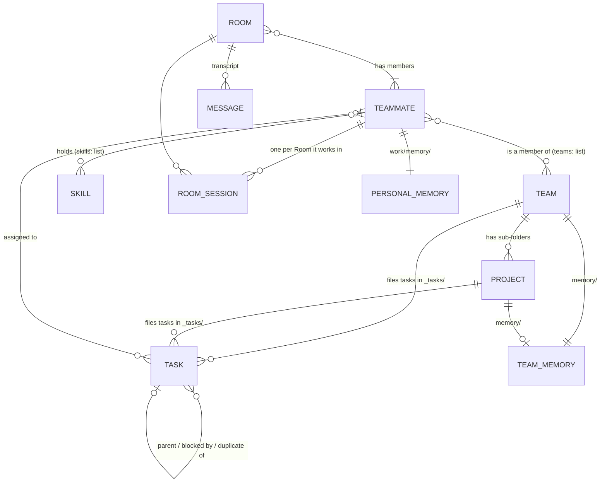

# Agency.Huddle user guide

Agency.Huddle is a chat workspace where you work with a small team of AI
**Teammates**. You talk to them in chat Rooms, organise them into Teams and
Projects, hand them Tasks, and share notes with them through the Library. This
guide is for the person running Huddle on their own machine. It explains what
each part of the app does, how the parts relate, and **what Huddle writes to
disk** every time you change something.

Applies to `main` as of 2026-09-29, which includes Room Sessions, Tasks, Skills,
the Library and Team Pages. This guide does not cover installing adapters or
configuring models. See [the chat-surface hub](AgencyTeam.md) for that.

## Contents at a glance

| If you want to… | Read |
| --- | --- |
| Understand how Teammates, Teams, Tasks and memory relate | [The data model](#the-data-model) |
| Free a long-running Teammate's memory without restarting it | [Freeing a Teammate's memory with `/compact`](#freeing-a-teammates-memory-with-compact) |
| Know which file a change lands in | [Where your data lives](#where-your-data-lives) and [What happens when…](#what-happens-when-reference) |
| Add or change a Teammate | [Working with Teammates](#working-with-teammates) |
| Set up Teams and Projects | [Organising Teams and Projects](#organising-teams-and-projects) |
| Chat with one or several Teammates | [Chatting in Rooms](#chatting-in-rooms) |
| Track work | [Tracking work with Tasks](#tracking-work-with-tasks) |
| Share notes and documents | [Keeping notes in the Library](#keeping-notes-in-the-library) |
| Teach Teammates a procedure | [Giving Teammates Skills](#giving-teammates-skills) |

## A quick tour of the screen

The left sidebar is the whole app. From top to bottom:

| Sidebar group | What it holds |
| --- | --- |
| **Chats** | Every Room you are in, plus **New chat**. |
| **Teams** | One row per Team. Expand it to see its Projects. **New team** sits at the bottom. The `⋯` menu on a Team row has **New project**. |
| **Teammates** | The page listing every Teammate, grouped by Team. |
| **Tasks** | Your saved Views of Tasks: **All Tasks**, **My Tasks**, any you saved, and **New view**. |
| **Library** | One row per Library root (**Teams**, **Teammates**, and any folders you pinned), plus **Add Folder**. |
| Bottom | **Archived chats** and **Settings**. |

Every page has its own address, so you can bookmark it:

| Address | Page |
| --- | --- |
| `/rooms/{roomId}` | A chat Room |
| `/teammates` | Teammates |
| `/teams/{Team}`, `/teams/{Team}/files`, `/teams/{Team}/tasks` | A Team page and its tabs |
| `/teams/{Team}/projects/{Project}` | A Project page |
| `/tasks/{viewId}` | A saved Task View |
| `/tasks/item/{TaskId}` | One Task, opened over your last View, for example `/tasks/item/BUSI-0001` |
| `/library?scopeRoot=teams&scopePath=` | The Library, scoped to a root |
| `/settings/{tab}` | Settings: Prompts, Appearance, Personas, Skills, Library |

## The data model

Huddle has a small number of things, and almost all of them are plain files you
can open in any editor. This section names each one and explains how they
connect. Later sections explain how to work with them.

### The things in Huddle

| Entity | What it is | Stored as |
| --- | --- | --- |
| **You (the Human)** | The person using the app. Your display name is `Team:HumanName` (default `You`). You are in every Room. | Config, and a row in `team.db` |
| **Teammate** (also called a **Persona**) | One AI Teammate: its name, job title, @alias, Teams, Skills, and its instructions. | `Teammates/<Name>/<Name>.md` |
| **Agent** | A Teammate that is running and online in chat. There is one Agent per Teammate file. | A row in `team.db`, plus a running adapter process |
| **Team** | A named group of Teammates. It has no file of its own. | A label in each member's `teams:` list, plus a folder `Teams/<Team>/` |
| **Project** | A piece of work inside one Team. | A sub-folder `Teams/<Team>/<Project>/` |
| **Room** | A chat conversation between you and one or more Agents. | Rows in `team.db` |
| **Message** | One chat message, in one Room. | One line in `rooms/<roomId>.jsonl` |
| **Room Session** | A Teammate's private working conversation for one Room. | Only a resume pointer, in `room-sessions/<Name>.json` |
| **Task** | A unit of work filed under a Team or Project, optionally assigned to someone. | `Teams/<Team>/[<Project>/]_tasks/<ID>.md` |
| **View** | A saved list or board of Tasks with filters. | `views.json` |
| **Library item** | Any note, folder or file you browse in the Library. | The file itself, wherever it lives |
| **Personal memory** | What one Teammate remembers across chats. | `Teammates/<Name>/work/memory/*.md` |
| **Team Memory** | Facts shared by every member of a Team, or by a Project. | `Teams/<Team>/memory/*.md` and `Teams/<Team>/<Project>/memory/*.md` |
| **Skill** | A named, reusable set of instructions a Teammate can read on demand. | `Skills/<skill-name>/SKILL.md` plus extra `.md` files |

### How they relate



The relationships that matter most:

- **A Teammate can belong to many Teams.** Membership is written on the
  Teammate, not on the Team. A Teammate file with
  `teams: ['Business', 'Household']` is a member of both, and appears under both
  on the Teammates page. A Teammate with no `teams:` line appears under **No
  team**.
- **A Team is a label plus a folder.** The list of Teams is every label used by
  any Teammate, plus every folder directly under `Teams/`. A folder with no
  members still shows, as **No members**. A label with no folder gets one
  created automatically.
- **A Project belongs to exactly one Team** and has no members of its own. The
  Team's members work on it. Any ordinary sub-folder of a Team folder is a
  Project, except `memory` and names starting with `_` or `.`.
- **A Task belongs to one Team, and optionally one Project.** Which one is
  decided by the folder the file sits in, not by a field. A Task has at most
  **one assignee**: a Teammate or you. A Task can have one parent Task
  (sub-tasks), a list of Tasks that block it, and can be marked a duplicate of
  another.
- **A Room always includes you**, plus one or more Agents. A Message belongs to
  exactly one Room.
- **A Teammate keeps a separate conversation per Room**: a Room Session. What it
  said in one Room is not visible in another. Only memory, Team Memory, Tasks and
  file changes cross between Rooms.
- **A Skill is attached to Teammates only**, by name, through the Teammate's
  `skills:` list. One Skill can be held by any number of Teammates. Skills are
  not attached to Teams, Projects or Rooms.

### Example: one Teammate file

A Teammate is a Markdown file with frontmatter. Everything below the frontmatter
is the Teammate's private instructions.

```markdown
---
name: 'Nova'
title: 'Coordinator'
alias: 'nova'
teams: ['Business', 'Household']
skills: ['team-building']
---
You are Nova. You keep the team's Tasks moving and summarise progress.
```

| Field | Required | Meaning |
| --- | --- | --- |
| `name` | Yes | The Teammate's identity. Must match the folder and file name. |
| `title` | Yes | Job title, shown on cards and to other Teammates. |
| `alias` | Yes | Short handle for mentions, as in `@nova`. |
| `teams` | No | The Teams this Teammate belongs to. |
| `skills` | No | Skills this Teammate may read. |
| `adapter` | No | Which AI adapter runs it. |
| `watches` | No | Extra folders it is told about when files change. |

**Model**, **Effort** and **Work mode** are not in the file. They are stored in
`team.db`, so you can change them without touching the Markdown. The **avatar**
is stored in `avatars.json`.

## Where your data lives

Everything Huddle keeps is under one **data root**, set by the configuration key
`Team:DataDir`. The default is `App_Data`, relative to where Huddle runs. In a
development checkout that is `src/Huddle.App/App_Data`.

```text
App_Data/
├── Teammates/                     Team:Acp:TeammatesDir
│   └── Nova/
│       ├── Nova.md                the Teammate definition
│       └── work/                  Nova's working folder (Team:Acp:WorkDir)
│           └── memory/            Nova's personal memory
├── Teams/                         Team:Teams:Dir
│   └── Business/                  a Team
│       ├── memory/                Team Memory
│       ├── _tasks/                open Tasks for the Team
│       │   ├── BUSI-0001.md
│       │   └── _closed/           closed Tasks
│       └── Website/               a Project
│           ├── memory/            Project memory
│           └── _tasks/
├── Skills/                        Team:Acp:SkillsDir; your own and overridden Skills
├── rooms/<roomId>.jsonl           one chat transcript per Room
├── room-sessions/<Name>.json      where each Teammate can resume each Room
├── file-state/<Name>.json         what each Teammate last saw of its folders
├── team.db                        SQLite: users, agents, rooms, members, models, task ID counters
├── views.json                     saved Task Views
├── library-roots.json             pinned Library folders (created on first change)
├── prompts.json                   prompt overrides from Settings
├── appearance.json                theme and accent colour
├── avatars.json, avatars/         avatars
└── logs/                          log files, when file logging is on
```

> [!WARNING]
> Some folders under the data root are managed by the app. Do not rename or move
> `rooms/`, `room-sessions/`, `file-state/`, `avatars/`, `logs/` or `team.db`.
> The Library refuses to open them, and hand edits can lose chat history.

## Working with Teammates

Open **Teammates** in the sidebar. The page lists every Teammate, grouped by
Team, with a **Team** filter at the top. A Teammate in two Teams is listed under
both. Each card shows a status of online, awake, asleep or offline.

Each Teammate has its own card with **Message**, **Edit**, **Open**,
**Restart** and **Remove**.

### Adding a Teammate

1. Select **New teammate**.
2. Fill in **Name**, **Title** and **Alias**. Optionally add **Teams** as a
   comma-separated list, choose **Skills**, **Model**, **Effort**, **Work mode**
   and an avatar.
3. Write the Teammate's instructions in the text area.
4. Select **Add teammate**.

**In the background:**

- Huddle composes the frontmatter and writes
  `Teammates/<Name>/<Name>.md`.
- Model, Effort and Work mode are written to `team.db`.
- The Teammate starts as an Agent and appears in chat. Its `work/` and
  `work/memory/` folders are created.
- Each Team label you entered that has no folder yet gets
  `Teams/<Team>/` created.

Names and aliases are at most 64 characters, start with a letter or digit, and
may contain letters, digits, `_`, `-` and single spaces. No dots. Names and
aliases must be unique across all Teammates. `Team:Acp:MaxTeammates` limits how
many Teammates can load (default 8).

The built-in **Chief of Staff** is the first Teammate you meet. It helps you put
a team together: it proposes Teammates, and nothing is created until you select
**Approve**. It has **Reset to default** instead of **Remove**.

### Editing a Teammate

Select **Edit** on the card, change the fields or the instructions, and select
**Save**.

**In the background:** Huddle rewrites `<Name>.md` in place. **Saving restarts
the Teammate and clears what it remembers of every conversation.** Its Rooms and
their transcripts stay. On its next turn in each Room it catches up by reading
up to the last 20 messages of that Room. Its personal memory files in
`work/memory/` are kept.

A restart also happens when you change Model, Effort, Work mode, Adapter, Skills
or Teams. Changing the avatar does not restart anything.

> [!NOTE]
> The Edit card has no **Teams** field. To change a Teammate's Teams after
> creating it, use the Team page's **Members** tab, or edit the `teams:` line in
> the text.

### Choosing a Work mode

A **Work mode** is how much the Teammate's agent may do before it must ask first.
Select **Edit** on the card and pick one in **Work mode**, directly under
**Effort**. The choices come from the Teammate's Adapter, so they are the
Adapter's own names and the text under the select describes the one you picked.

For the Claude adapter the choices are:

| Choice | What it does |
| --- | --- |
| **Use the agent's default** | Huddle sends nothing and the agent starts in its own mode, which is Manual. |
| **Manual** | The agent asks before it makes changes. |
| **Accept edits** | The agent edits files without asking. |

**Plan**, **Auto** and **Bypass permissions** are not offered. **Plan** is hidden
because a Teammate in it ends its turn without posting a reply. **Auto** hands
permission decisions to the model and changes with the Model. **Bypass
permissions** removes every prompt. An operator who wants them back changes
`Team:Acp:HiddenModes`. A mode on the hidden list is never sent, even if one is
already stored for a Teammate.

**In the background:**

- The mode is stored in `team.db`, not in `<Name>.md`.
- It is applied every time the Teammate starts or resumes, after its Model and
  Effort.
- **Saving a different Work mode restarts the Teammate and clears what it
  remembers**, as a Model change does.
- Changing the **Adapter** resets Work mode to the agent's default and the card
  says so. Each Adapter advertises its own modes, so pick one again if you want
  one.
- An Adapter that advertises no modes shows no Work mode select.

> [!NOTE]
> Work mode changes what the agent asks, not who answers. Huddle still approves
> the agent's permission requests on its own; nothing here asks you before a tool
> runs. One thing is refused whatever the mode: a tool call that writes a file
> inside the agent's own `~/.claude` folder. A shell command that redirects into
> it is not caught.

### Renaming a Teammate

Change **Name** on the Edit card and save. Huddle warns you first:
messages already posted keep the old name, because the transcript records what
was said at the time.

**In the background:**

- The folder `Teammates/<Old>/` moves to `Teammates/<New>/` and the definition
  file is renamed with it.
- The avatar, `file-state/`, `room-sessions/` entries and the `team.db` row are
  renamed.
- Every Task whose `creator:` or `assignee:` was the old name is rewritten, open
  and closed, and saved Task Views that filtered on it are updated. No Change
  log line is added to those Tasks.
- Rooms that were auto-named after the Teammate are renamed. Rooms you named
  yourself are left alone.

### Removing a Teammate

Select **Remove** and confirm.

**In the background:** only `<Name>.md` is deleted, along with its Model, Effort,
Work mode, avatar and resume entries. The Teammate goes offline. Its Rooms, their
transcripts and its `work/` folder stay on disk. Tasks still assigned to it keep
the name and no longer wake anyone.

### Restarting a Teammate

**Restart** deletes `room-sessions/<Name>.json` and restarts the Teammate. Every
Room then starts a fresh conversation, with catch-up from the transcript. Use it
when a Teammate seems confused.

### Editing the file by hand

You can open a Teammate's file with **Open** or through the Library and edit it
in any editor. Huddle watches the `Teammates/` folder and picks up a saved change
within half a second. It behaves exactly like an in-app edit, including the
restart. A file that fails validation is listed under **Files that didn't load**
on the Teammates page, with the reason.

## Organising Teams and Projects

### Creating a Team

Select **New team** at the bottom of the Teams group, type a name, and select
**Create**.

**In the background:** Huddle creates the folder `Teams/<Team>/`. Nothing else
is written and no Teammate restarts. The new Team shows **No members** until you
add someone.

Team names cannot contain `,` `;` `[` `]`, cannot start with `_` or `.`, and
must follow the Library file-name rules (no `/ \ : < > " | ? *`, no trailing dot
or space, no Windows device names like `CON`). Names are unique regardless of
case.

### Adding and removing members

Open the Team, then the **Members** tab.

- **Add member** opens a picker of Teammates not yet in the Team. Huddle
  tells you that adding restarts the Teammate.
- **Remove from Team** in a row's menu asks you to confirm, with the same
  warning.

**In the background:** Huddle rewrites only the `teams:` line in that
Teammate's `<Name>.md`, then saves. The Teammate restarts and loses its
conversation memory, and on restart it is told about the new Team's memory.
Removing the last member does **not** delete the Team folder. The Team stays,
marked **No members**.

> [!CAUTION]
> Close any open Teammate Edit card before adding or removing members. A card
> saves its whole text, so saving a card that was open during the membership
> change puts the old `teams:` line back.

### Creating a Project

On a Team row in the sidebar, open `⋯` and select **New project**. Or, in the
Team's **Files** tab, open a Team folder's menu and select **New Project**.

**In the background:** Huddle creates `Teams/<Team>/<Project>/`. `memory` is
reserved, and so are names starting with `_` or `.`.

Any folder you create directly inside a Team folder, from the Library or your
file manager, becomes a Project too. There is no separate Project record.

### Renaming or deleting Teams and Projects

Huddle does not offer this, and the Library refuses to rename, move or delete
Team and Project folders. To retire a Team, remove it from every member. The
folder and its Tasks remain on disk.

### The Team and Project pages

Select a Team or Project in the sidebar.

| Tab | On a Team page | On a Project page |
| --- | --- | --- |
| **Members** | Members, with status, title and alias; search; Add and Remove. Opening a row opens the Teammate card. | Not shown. Projects are worked by the Team. |
| **Files** | The Library, scoped to `Teams/<Team>/`, with **New note** and a file-name search. | Scoped to `Teams/<Team>/<Project>/`. |
| **Tasks** | A board of the Team's Tasks, one swimlane per Project. **New task** fills in the Team. | A single-lane board. **New task** fills in the Team and Project. |

The Files tab is hidden when the Library is turned off (`Team:Library:Enabled`).
The Tasks tab is hidden when Tasks are turned off (`Team:Tasks:Enabled`).

## Chatting in Rooms

### Starting a chat

Select **New chat** and pick one or more Teammates. Choosing a single Teammate
reopens your existing one-to-one Room with it, if there is one.

**In the background:** Huddle adds the Room and its members to `team.db`. The
Room gets a name derived from its members. Its transcript file is created in
`rooms/<roomId>.jsonl` when the first message is posted.

### Who answers

| Room | Behaviour |
| --- | --- |
| You and one Teammate | The Teammate answers every message. |
| You and two or more Teammates | A Teammate answers only when you mention it, as in `@nova`. |

Type `/invite @alias` in the message box, or use the Invite control, to add a
Teammate to the current Room.

Teammates can reply to each other. To stop runaway conversations, a Room has a
**Budget**: after a number of Agent replies without you speaking, Agents pause
and Huddle asks whether to **Continue** or **Leave paused**. Your next message
resets it.

### What happens when you send a message

1. Huddle appends one line of JSON to `rooms/<roomId>.jsonl`. Transcripts are
   append-only and are never rewritten.
2. The Teammates who should answer each take a turn in **their own Room Session
   for this Room**. A Teammate runs one turn at a time across all its Rooms.
3. At the start of the turn, the Teammate is told about any files that changed
   in its folders since its last turn in this Room (see
   [Memory and file changes](#memory-and-file-changes)).
4. When the turn ends, Huddle saves the session's resume pointer to
   `room-sessions/<Name>.json`.

Room Sessions are opened on demand and closed after 30 minutes idle. At most 3
are open per Teammate at once. A closed session resumes where it left off if the
adapter supports it. Otherwise it starts fresh and catches up from the last 20
messages of the transcript.

### Linking to Tasks and files

- Type `#` at the start of a word to pick a Task. A Task ID such as `BUSI-0001`
  in a message becomes a link to the Task.
- An absolute path to a Library file becomes a link that opens the file in the
  Library pane. The Teammates who answer are also given the list of those files,
  or, for adapters that cannot read files, the text of small ones.

### Freeing a Teammate's memory with `/compact`

A Teammate that has worked in a Room for a long time carries a long conversation.
**Compacting** summarises it, which frees space and usually speeds and cheapens
later turns, without the **Restart** that forgets the conversation entirely. To
compact one Teammate, **mention it and then write the command**:

```text
@nova /compact
```

You can add guidance after the name, which is passed to the Teammate as written:
`@nova /compact keep the decisions and the open questions`.

When it finishes, the Teammate posts one line in the Room, for example
`Compacted my conversation: 50,624 → 2,964 tokens in 9 s.` It still knows the
conversation, but as a summary: a detail you care about may not survive, so put
lasting facts in memory files.

- **The mention comes first, and is required.** This works in a Room of two as
  well. A bare `/compact` is refused with *Unknown command*, because a message
  that starts with a slash is one of Huddle's own commands (such as `/invite`).
- **Only you can run one.** The same text from another Teammate is an ordinary
  message.
- **Only listed commands work.** `/compact` is the one offered to Teammates on the
  standard Claude adapter. Anything else you write after a mention, such as
  `@nova /config`, is sent as ordinary text and runs nothing. A Teammate's
  card lists what it offers: open **Teammates**, select the Teammate, and look for
  lines like `/compact — Free up context by summarizing the conversation so far`.
  The line is absent while the Teammate is offline.
- **It costs a little.** A compaction is a model call, and Huddle does not show it
  in the **Spent since start** line. The Teammate's token budget may also count
  slightly fewer tokens afterwards than were really used.
- **Stop works.** Use **Stop** to cancel one in progress; a stopped command posts
  nothing.

If a Teammate has just started and you write the command straight away, it may be
treated as an ordinary message, because it has not yet told Huddle what it
offers. Try again a moment later.

**In the background:** your message is stored like any other, in
`rooms/<roomId>.jsonl`. Huddle sends only the command to the Teammate's adapter for
that turn, without the Room context, and keeps any messages the Teammate missed
for its next ordinary turn. The Teammate's own summary lives in its adapter
session; nothing new is written to disk for the compaction itself.

### Renaming, archiving and deleting Rooms

| Action | In the background |
| --- | --- |
| **Rename** (pencil icon beside the Room name) | Updates `team.db`. A name you type is kept even when members change. |
| **Archive** | Adds the Room to the archived list in `team.db`. It only hides the Room; it still works and can still be woken. Find it under **Archived chats**. |
| **Delete** | Removes the Room from `team.db` and **permanently deletes** `rooms/<roomId>.jsonl`. Asks for confirmation. |

> [!WARNING]
> Deleting a Room cannot be undone. The transcript file is deleted, not moved to
> the Recycle Bin. Archive the Room instead if you might want it later.

## Memory and file changes

Teammates do not keep conversations between restarts, so anything worth
remembering goes into files. There are two kinds of memory, both plain Markdown
folders.

| Memory | Folder | Who sees it |
| --- | --- | --- |
| **Personal memory** | `Teammates/<Name>/work/memory/` | That Teammate only. Created when the Teammate starts. |
| **Team Memory** | `Teams/<Team>/memory/` | Every member of the Team. |
| **Project memory** | `Teams/<Team>/<Project>/memory/` | Every member of the Team. |

The convention is **one file per fact, with the fact on the first line**. For
example, `Teams/Business/memory/invoice-day.md`:

```markdown
Invoices go out on the last working day of each month.

Use the template in Business/templates/invoice.md.
```

Teammates write memory with their own file tools. You can write it too: open the
Team's **Files** tab, select the `memory` folder, and select **New note**.
Huddle creates the `memory/` folder the first time something is written there.

**How Teammates learn about it:**

- **When a session opens**, each Teammate's system prompt includes an index of
  its personal memory and of the Team Memory of every Team it belongs to. Each
  entry is the file's first line, cut at 200 characters. The Team index lists at
  most 50 entries in total (`Team:Teams:MaxMemoryEntries`).
- **At the start of each turn**, a Teammate is told which files were added,
  changed or deleted in its **watched folders** since its last turn in that
  Room. Watched folders are its own `work/` folder, the folder of each of its
  Teams (excluding `_tasks`), and any folders it chose to watch. Huddle keeps
  what it last saw in `file-state/<Name>.json`.

Memory and file changes require `Team:FileChanges:Enabled` (on by default) and an
adapter that can read files. Without them, Teammates get no memory index.

> [!NOTE]
> The `memory/` folder is not protected in the Library the way Team and Project
> folders are. You can rename or delete it, and Teammates will lose the index.

## Tracking work with Tasks

A **Task** is a Markdown file under a Team or Project. You and your Teammates
see the same Tasks, and a change to an assigned Task wakes the assignee.

### What a Task file looks like

`Teams/Business/_tasks/BUSI-0002.md`:

```markdown
---
id: BUSI-0002
title: Second task for the Board
status: To Do
priority: Medium
creator: You
assignee: Nova
tags:
  - billing
due_date: 2026-10-15
---
Draft the October invoice run and check it against last month.

## Change log
- 2026-09-25T08:30:00Z | You | created
- 2026-09-25T09:12:41Z | You | assignee: — → Nova
```

| Field | Meaning |
| --- | --- |
| `id` | `<PREFIX>-<number>`. The prefix is the first four letters of the Team name, upper-cased, chosen once and stored in `team.db`. Numbers are never reused. |
| `title` | One line, 1–200 characters. |
| `status` | One of the eight statuses below. |
| `priority` | Low, Medium, High or Urgent. |
| `creator`, `assignee` | A Teammate's name, or your name. One assignee at most. |
| `origin` | The Room the Task was created from, if any. |
| `parent`, `blocked_by`, `duplicate_of` | Links to other Tasks. |
| `tags`, `start_date`, `due_date` | Dates are `yyyy-MM-dd`. |
| Body | The description, in Markdown. |
| `## Change log` | An append-only history. Huddle adds lines and never edits old ones. |

The Team and Project are not fields. They come from the folder the file is in.

### Statuses

| Status | Group |
| --- | --- |
| Backlog, To Do, In Progress, Review | Open |
| Done | Finished |
| Cancelled, Duplicate, Rejected | Won't do |

You can move a Task from any status to any other. **Duplicate** requires naming
the original Task. **Cancelled** and **Rejected** accept an optional reason.

**Closed is separate from status.** Closing a Task hides it from active Views and
boards; it does not change its status. Huddle never closes Tasks automatically.
There is no delete.

### Creating and editing Tasks

Select **New task** on the Tasks page or a Team page's Tasks tab. The panel has
Title, Status, Priority, Assignee, Team / Project, Parent, blockers, Tags, Start
and Due date, and a description with **Edit** and **Preview**. Select **Save**.
If the Task is assigned to a Teammate, the button reads **Save & Notify
{Name}**.

| Action | In the background |
| --- | --- |
| **Create** | Writes a new `<ID>.md` in the Team's or Project's `_tasks/` folder, with a `created` Change log line. Defaults are Backlog and Medium. |
| **Edit any field** | Rewrites the frontmatter and appends one Change log line summarising what changed, such as `status: To Do → In Progress`. |
| **Drag a card on the Board** | Saves immediately, same as an edit. |
| **Change Team or Project** | Moves the file to the other folder's `_tasks/`, and logs `moved: A → B`. A new Project name typed here creates the Project folder. |
| **Close task** / **Reopen** | Moves the file into or out of `_tasks/_closed/` and logs `closed` or `reopened`. |
| **Make a copy** | Opens an unsaved copy titled `Copy of …`. Nothing is written until you save. |

Every write goes to a temporary file first and is then moved into place, so a
Task file is never half-written. If someone else (a Teammate, or you in another
window) changed the same Task while you were editing, Huddle merges changes to
different fields silently and asks **Keep mine** or **Take theirs** for a field
you both changed.

### How Task changes reach Teammates

When a Task assigned to a Teammate changes, Huddle **wakes** the assignee by
posting a message in a Room, as the person who made the change:

```text
@nova Task BUSI-0002 "Second task for the Board" (In Progress, Business) was changed by You:
status: To Do → In Progress
Call get_task with taskId BUSI-0002 for the full task.
```

- The Room is, in order of preference: the Task's origin Room; a Room with
  exactly you, the creator and the assignee; otherwise a new Room.
- Changes by the same person within 5 seconds are combined into one message.
- No one is woken for their own changes, for Tasks assigned to you, or for
  assignees that are not known Teammates.
- Teammates changing each other's Tasks could loop, so each Task allows 10
  Teammate-made wake-ups. After that, changes are still saved but nobody is
  woken until you select **Allow 10 more** in the Task panel. Any change you make
  resets the count.

The panel tells you what will happen before you save, for example "Nova is
offline, so this change won't reach them."

Teammates use the tools `create_task`, `get_task`, `list_tasks`, `update_task`,
`close_task` and `reopen_task`. Their changes follow the same rules and write the
same files.

### Views: lists and boards

A **View** is a saved way of looking at Tasks. **All Tasks** and **My Tasks**
are built in. Select **New view** to make your own.

| Setting | Options |
| --- | --- |
| Kind | **List** or **Board** |
| Scope | **Active** or **Closed** Tasks |
| Filters | Team, Project, Assignee, Status, Priority, and Blocked / Unblocked / All |
| Fields shown, grouping, sorting | As you choose. Boards also let you rename, hide and reorder columns. |

The toolbar above a View lets you filter, group, search and switch List/Board
for the current visit only. **Save to view** keeps those changes.

**In the background:** Views are saved to `views.json` in the data root. If that
file has a syntax error, Huddle shows the line and column and makes Views
read-only until you fix it.

### Editing Task files by hand

You can edit a Task file in any editor. Huddle watches the `Teams/` folder:

- **While Huddle runs**, it notices the save within half a second, appends
  `edited outside Huddle: <what changed>` to the Change log, and wakes the
  assignee.
- **While Huddle is stopped**, it notices at the next start, logs the same line,
  and wakes no one.
- **Deleting a Task file** makes the Task disappear without a log entry.

A file that fails to load is shown under **Tasks that didn't load**, with the
reason.

## Keeping notes in the Library

The **Library** is a file browser and Markdown editor over your data folders. It
is how you and your Teammates share documents.

### Library roots

A **root** is a top-level folder shown in the Library:

| Root | Folder |
| --- | --- |
| **Teams** | `Teams/`: Team and Project folders and their notes. Task folders (`_tasks`) are hidden. |
| **Teammates** | `Teammates/`: each Teammate's definition and `work/` folder. |
| Pinned folders | Any folder on your machine you add with **Add Folder** or in **Settings › Library**. |

Pinned folders are saved in `library-roots.json` in the data root. The file is
created the first time you add, remove or hide a root. **Reset pinned folders**
deletes it and goes back to the configured list (`Team:Library:Roots`). Hand
edits to `library-roots.json` are only read at startup.

### Reading and editing notes

Select a file to open it. Markdown files open with **Read**, **Edit** and
**Split** modes; `Ctrl+S` saves. Text and code files are read-only. Images are
previewed. Files larger than 2 MiB are read-only.

**In the background:** a save writes a temporary file beside the note and moves
it into place, keeping the file's original encoding and line endings. If the
file changed on disk since you opened it, Huddle warns you and offers **Reload**
or **Keep mine**. Saving a Teammate's definition file restarts that Teammate.

Teammates are told about your saves at their next turn if the file is in one of
their watched folders.

### Links between notes

Write `[[Note name]]`, `[[folder/Note]]`, `[[Note|shown text]]` or
`[[Note#Heading]]`. Links resolve within the same root, in the style of
Obsidian. Each note shows its **Backlinks**, the notes that link to it. A link to
a missing note offers to create it.

### Organising files

Open the `⋯` menu on any item, or right-click it.

| Action | In the background |
| --- | --- |
| **New note** | Creates an empty file (`.md` added if you give no extension). |
| **New folder** | Creates the folder. Inside a Team folder, this is a new Project. |
| **Rename** / **Move** | Moves the file or folder, then rewrites `[[links]]` in every note in the root that pointed at it. The dialog tells you how many links will change. Notes it could not update are listed. Moves stay within one root. |
| **Copy path** | Copies the full path, which you can paste into chat. |
| **Delete** | Sends the item to the **Windows Recycle Bin**. Refused on network or removable drives, where the Recycle Bin is not available. |

Roots, Team folders, Project folders, Teammate folders, definitions and `work/`
folders cannot be renamed, moved or deleted here. Folders that hold Tasks cannot
be moved. File names follow Windows rules: no `/ \ : < > " | ? *`, no trailing
dot or space, no device names such as `CON` or `NUL`.

The search box matches file names, not content, and shows at most 200 results.

## Giving Teammates Skills

A **Skill** is a folder of Markdown instructions that a Teammate reads only when
it needs them, such as how to build a team or how to write a release note. It
keeps the Teammate's main instructions short.

### Assigning a Skill

On a Teammate's Edit card, pick Skills in the **Skills** list and save.

**In the background:** Huddle writes `skills: ['a', 'b']` into the Teammate's
`<Name>.md` and restarts it. The Teammate's system prompt then lists each Skill's
name and description, and it gets the `read_skill` tool to read them.

### Writing your own Skill

Skills have no editor in the app. Create a folder under `Skills/` in the data
root:

```text
App_Data/Skills/release-notes/
├── SKILL.md
└── examples.md
```

```markdown
---
name: release-notes
description: How to write release notes for the Business team's product updates.
---
Start with what the user can now do. One bullet per change. ...
```

| Rule | Detail |
| --- | --- |
| `name` | Lower-case words joined by `-`, equal to the folder name. |
| `description` | Required. Keep it under 300 characters; over 500 is an error. |
| Files | Only `.md` files directly in the folder count, up to 64 KB each. Sub-folders are ignored. |

Huddle watches `Skills/` and picks up a new or changed Skill within a second.
Editing a Skill does not restart anyone. Teammates read the current text the
next time they call `read_skill`. Check **Settings › Skills** for problems: an
invalid Skill is listed under **Problems** with the reason.

### Changing a built-in Skill

Huddle ships one Skill, `team-building`, used by the Chief of Staff. To change it,
create `Skills/team-building/` and put a file of the same name in it, for
example `onboarding.md`. Your file replaces that one file; the others still come
from the built-in version. **Settings › Skills** marks the Skill as
**Overridden**. **Restore default** deletes your whole
`Skills/team-building/` folder, including any extra files you added.

## Settings

| Tab | What it changes | Saved to |
| --- | --- | --- |
| **Prompts** | The text Huddle sends to Teammates, such as the wake-up message. | `prompts.json` |
| **Appearance** | Theme, light/dark, accent colour, which side the Library pane opens on. | `appearance.json` |
| **Personas** | The Teammate definitions. | `Teammates/…` |
| **Skills** | Read-only list of Skills and their problems; **Restore default**. | `Skills/…` |
| **Library** | Pinned folders; hide the built-in roots. | `library-roots.json` |

## What happens when… (reference)

| You… | Huddle writes | Teammate effect |
| --- | --- | --- |
| Add a Teammate | `Teammates/<Name>/<Name>.md`, `team.db`, `Teams/<label>/` if missing | Comes online |
| Edit a Teammate, or change Model, Effort, Work mode, Skills or Teams | Rewrites `<Name>.md` (Model, Effort and Work mode in `team.db`) | Restarts; conversation memory cleared |
| Rename a Teammate | Moves `Teammates/<Old>/`; renames entries in `room-sessions/`, `file-state/`, `avatars.json`, `team.db`; rewrites Task creators and assignees and View filters | Restarts |
| Remove a Teammate | Deletes `<Name>.md` only | Goes offline; Rooms, transcripts and `work/` stay |
| Restart a Teammate | Deletes `room-sessions/<Name>.json` | Every Room starts fresh, with catch-up |
| Create a Team | `Teams/<Team>/` | None |
| Add or remove a Team member | The `teams:` line in `<Name>.md` | That Teammate restarts |
| Create a Project | `Teams/<Team>/<Project>/` | Members see it as a file change |
| Start a chat | `team.db` | None until you post |
| Post a message | One line appended to `rooms/<roomId>.jsonl` | Addressed Teammates take a turn |
| Write `@name /compact` | One line in `rooms/<roomId>.jsonl`, then the Teammate's outcome line | That Teammate compacts its conversation; other Teammates only read the outcome |
| Archive a Room | `team.db` | None; Room still works |
| Delete a Room | `team.db`; deletes `rooms/<roomId>.jsonl` permanently | Resume entry pruned at next start |
| Create or edit a Task | `Teams/<Team>/[<Project>/]_tasks/<ID>.md` with a Change log line | Assignee woken |
| Close or reopen a Task | Moves the file to or from `_tasks/_closed/` | Assignee woken |
| Save a View | `views.json` | None |
| Save a Library note | The note, atomically | Watchers see a file change next turn |
| Rename or move a Library item | The item, plus every note linking to it | Watchers see file changes |
| Delete a Library item | Moved to the Recycle Bin | Watchers see a deletion |
| Pin a Library folder | `library-roots.json` | None |
| Add or change a Skill folder | Nothing; you write `Skills/<name>/` | Read on next `read_skill` |
| Edit any of these files by hand | — | Same as the in-app action; Tasks log `edited outside Huddle` |

## Troubleshooting

| Symptom | Cause and fix |
| --- | --- |
| `@nova /compact` got an ordinary reply instead of compacting | The Teammate does not offer that command (check its card), it was not yet online, or another Teammate wrote it. Only you can run a command, and only those listed on the card. |
| `/compact` on its own says *Unknown command* | Write the mention first: `@nova /compact`. |
| A Teammate forgot our conversation | It was restarted: an edit, a membership change, or **Restart**. Put lasting facts in memory files. |
| A Teammate file does not appear | See **Files that didn't load** on the Teammates page. Common causes: missing `name`, `title` or `alias`, a duplicate alias, or `name` not matching the file. |
| All Teammates show **Offline** | The agent host is off, for example when Huddle is started with `--Team:Acp:Enabled=false`. |
| A Task did not wake its assignee | The assignee is you, the change was made by the assignee, the assignee is offline or no longer exists, or the Task's wake budget is spent (**Allow 10 more**). |
| A Task file is missing from every View | It is under **Tasks that didn't load**, or it is in `_closed/` and the View's scope is Active. |
| A Team still appears after I removed everyone | Removing members never deletes the folder. The Team shows **No members**. |
| A membership change was undone | A Teammate Edit card that was open during the change saved its old text. Re-add the member. |
| Delete in the Library says the Recycle Bin isn't available | The file is on a network or removable drive. Delete it in your file manager. |
| A new Skill doesn't show | Check **Settings › Skills › Problems**. The `name` must match the folder name. |
